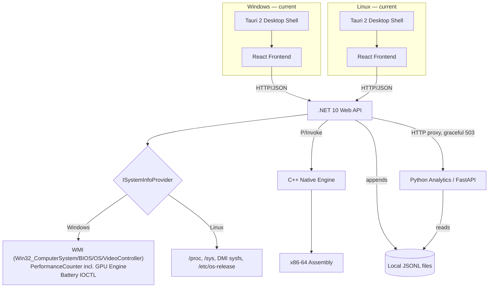

<div align="center">

# 📋 System Info — Engineering Status

**13 phases tracked · 11 fully done · 1 split by platform · 1 continuous ("maintenance & extensibility") · 1 discipline: prove every layer before building the next one**

`Linux Mint (primary dev)` · `Windows (Tauri desktop target)` · `.NET 10` · `React 19 + TypeScript` · `C++17` · `x86-64 Assembly` · `Python / FastAPI` · `Rust (Tauri 2)` · `Local JSON Lines`

</div>

---

## 📑 Contents

1. [Current Architecture](#current-architecture)
2. [Backend Status](#backend-status)
3. [Frontend Status](#frontend-status)
4. [Windows Desktop Integration](#windows-desktop-integration)
5. [Hardware, GPU & Battery Monitoring](#hardware-gpu--battery-monitoring)
6. [Storage](#storage)
7. [API Surface](#api-surface)
8. [Speed Test](#speed-test)
9. [Languages Used](#languages-used)
10. [Build & Packaging](#build--packaging)
11. [Release Pipeline](#release-pipeline)
12. [Version & Changelog Management](#version--changelog-management)
13. [Testing / Validation](#testing--validation)
14. [Known Limitations](#known-limitations)
15. [Historical Architecture](#historical-architecture)
16. [Phase Log](#phase-log)
17. [Performance Metrics](#performance-metrics)
18. [Remaining Work](#remaining-work)

---

## Current Architecture



This is the fifth architectural shape the project has taken (see [Historical Architecture](#historical-architecture) for the earlier four). Shape 4 brought the Tauri native-window model to Windows only; this pass (Shape 5) brought Linux onto the same model — the `.deb`/AppImage now install and run the Tauri shell directly (no `sudo`, no system-wide `uvicorn`, no browser tab, no manual `localhost:5173`), replacing the `start-all.sh`-in-a-terminal production path. `process.rs`, `commands.rs`, and the rest of the Rust shell were already fully cross-platform going into this pass (Windows-only bits like `win32job` were already `cfg(windows)`-gated) — what changed was the Linux CI job (`build-linux` in `release.yml`, previously a hand-rolled `dpkg-deb`/`appimagetool` script wrapping `start-all.sh`) and `tauri.conf.json`'s bundle targets/icons, not the shell's own logic.

---

## Backend Status

`backend/SystemMonitor.Api` — ASP.NET Core Minimal API, .NET 10.

| Component | Status | Notes |
|---|:-:|---|
| `ISystemInfoProvider` (Linux/Windows dispatch) | ✅ | Selected at startup via `OperatingSystem.IsWindows()`/`IsLinux()`; throws `PlatformNotSupportedException` on anything else |
| `SystemMonitorBackgroundService` | ✅ | Hosted service; samples CPU/network continuously after a 3s startup delay, caches in memory, appends each sample to the snapshot store |
| `ISnapshotStore` / `LocalJsonSnapshotStore` | ✅ | Append-only `data/snapshots/{yyyy}/{MM}/{dd}.jsonl`; malformed lines are skipped with a logged warning, not thrown |
| `AppDataPath` | ✅ | Resolves the writable data directory: `SYSTEM_INFO_DATA_DIR` override → `./data` in `Development` → `%LOCALAPPDATA%\SystemInfo\data` (Windows) / `~/.local/share/SystemInfo/data` (Linux) |
| `GetSystemIdentity()` (both providers) | ✅ | Windows: `Win32_ComputerSystem`/`Win32_BIOS`/`Win32_OperatingSystem`, each query independently null-safe. Linux: DMI sysfs + `/etc/os-release` + `/proc/uptime` |
| `GetGpus()` (Windows) | ✅ | `Win32_VideoController` for every adapter + `GPU Engine` perf-counter sampling (200ms settle), engines attributed to adapters by `_phys_N_` instance-name parsing on multi-GPU systems |
| `GetGpus()` (Linux) | ⬜ | Returns empty — Linux GPU detection lives in the native engine's `/api/native/gpu` path instead, not yet unified into this interface |
| Native P/Invoke bridge (`Native/NativeInterop.cs`) | ✅ | Calls into `libsystemmonitor_native.so`/`.dll` |
| CORS | ✅ | `http://localhost:5173` (Vite dev), `http://tauri.localhost` (Tauri 2 WebView2), `tauri://localhost` (non-Windows Tauri targets) |
| `HttpClient("AnalyticsService")` | ✅ | Named client, `http://localhost:8001`, 10s timeout |
| `GET /health` | ✅ | Dependency-free readiness probe for the Tauri process manager; deliberately outside `/api/system` |
| Static frontend hosting | ✅ | `UseStaticFiles` + `MapFallbackToFile("index.html")` against `wwwroot`, only when it exists (skipped in dev, where Vite serves the frontend separately) |

---

## Frontend Status

`frontend/src` — React 19, TypeScript, Vite 8.

| Component | Status | Notes |
|---|:-:|---|
| Seven dashboard sections (`components/views/`) | ✅ | Overview, Analytics, Processes, Storage, Network, Battery, System — routed from `App.tsx`'s `SECTIONS` array |
| Shared design-system primitives (`components/common/Primitives.tsx`) | ✅ | One spacing scale, one type scale, one card shape, one responsive grid, including a reused `Unavailable` component for any unsupported metric |
| Live-freshness indicator | ✅ | `Live · updated Ns ago` → `Reconnecting` → `Offline`, driven by `useSystemMetrics` |
| Analytics time-range selector (1h/6h/24h/7d) | ✅ | Backed by `/api/analytics/*`'s `minutes`/`window` query params |
| `apiConfig.ts` centralized API base resolution | ✅ | Covers Vite dev server, Tauri desktop, and the legacy browser-hosted launcher, replacing three duplicated `API_BASE` constants |
| `ServiceControls.tsx` (Start/Stop/Exit) | ✅ | Only rendered inside the Tauri shell (`lib/tauri.ts` detects the runtime) |
| Empty-history / analytics-down states | ✅ | `TrendSummary`/`StatsSummary`/`BottleneckTimeline` treat every analytics field as optional, avoiding the fresh-install white-screen bug fixed in `2.1.0` |
| `useSystemInfo` bounded startup retry | ✅ | 300ms/600ms/1s/1.5s/2s backoff before surfacing a real error, with a manual Retry action — fixes the System tab getting permanently stuck on "Failed to fetch" after a normal cold start |
| `useSystemGpu` | ✅ | Polls `/api/system/gpu` on its own interval, independent of the CPU/RAM cycle, with its own scoped error state so a GPU read failure never blanks the rest of the System tab |
| GPU panel(s), System tab | ✅ | Renders one panel per detected adapter; active engines listed individually rather than summed |

---

## Windows Desktop Integration

| Component | Status | Notes |
|---|:-:|---|
| `frontend/src-tauri/` (Tauri 2 shell) | ✅ | Native window (`tauri.conf.json`: 1280×820, resizable, min 980×650) |
| `process.rs` service lifecycle | ✅ | Spawns backend (`:5132`) and analytics (`:8001`) as children, polls `/health` on each (30s timeout, 400ms interval) |
| Windows Job Object orphan hardening | ✅ (Windows only) | Each child gets its own Job with `KILL_ON_JOB_CLOSE`, specifically to catch a PyInstaller `--onefile` bootstrap's extracted interpreter process, which a plain `Child::kill()` can miss |
| `commands.rs` — `start_services`/`stop_services`/`get_service_status`/`exit_app` | ✅ | The *entire* frontend-facing process-control surface; no `tauri-plugin-shell`, no generic command-execution capability |
| `CREATE_NO_WINDOW` on spawned children | ✅ | Backend and analytics no longer open visible console windows on Windows (fixed in `2.1.1`) |
| `ureq` for readiness polling | ✅ | Deliberately not `reqwest`+`tokio` — these are short, blocking, local calls from a background thread, not hot-path async work |

---

## Hardware, GPU & Battery Monitoring

**GPU — two independent detection paths exist:**

| Path | Platform | Route | What it returns |
|---|---|---|---|
| `ISystemInfoProvider.GetGpus()` | Windows | `GET /api/system/gpu` | Every adapter via `Win32_VideoController` (name, video processor, adapter memory, driver version/date, status, resolution, refresh rate) + live per-engine utilization from the `GPU Engine` performance-counter category |
| Native engine `get_gpu_vendor()` / `get_amd_gpu_usage_percent()` | Linux (primarily) | `GET /api/native/gpu` | Vendor detection via `/sys/class/drm` (dynamic scan, not hardcoded `card0`) and AMD usage via sysfs |

These have not yet been unified — the Windows path is the newer, more structured one; the native-engine path predates it and remains Linux's only GPU source.

**Battery:**

| Platform | Source | Status |
|---|---|---|
| Linux | Dynamic `BAT*` sysfs discovery, unit auto-detection (`CHARGE_*` vs `ENERGY_*`) | ✅ Verified live (52% charge, discharging, 13.9W, 77% health, on the reference dev machine) |
| Windows | `WindowsBatteryInterop.cs` — `IOCTL_BATTERY_QUERY_TAG`/`_INFORMATION`/`_STATUS` | ✅ Implemented, aggregated across multiple batteries — **not hardware-tested on real Windows hardware** |

**Temperature & fan:** native engine, `/api/native/cputemp` and `/api/native/fan`. ACPI thermal-zone data is never presented as CPU/GPU temperature without a verified mapping; a missing fan sensor correctly reports `Unavailable`, not `0`.

---

## Storage

**Before → Why → Now**, in detail:

| | |
|---|---|
| **Before** | `SnapshotLogger.cs` wrote documents to **MongoDB Atlas**; `analytics_service.py` queried Mongo directly; a `MONGO_URI` connection string (originally planned as PostgreSQL, switched mid-phase to an already-available Atlas cluster) had to be configured before analytics worked at all. |
| **Why it changed** | An external database added an account dependency and a network requirement to what is otherwise a fully local, offline-capable desktop application. |
| **Now** | `ISnapshotStore` / `LocalJsonSnapshotStore` — append-only `data/snapshots/{yyyy}/{MM}/{dd}.jsonl`, resolved by `AppDataPath.cs` (`./data` in dev, `%LOCALAPPDATA%\SystemInfo\data` on Windows, `~/.local/share/SystemInfo/data` on Linux). `analytics_service.py` reads the `.jsonl` files for the requested range directly; malformed lines are skipped and logged, not thrown. |

No retention/TTL policy exists yet — `data/snapshots/` grows unbounded (documented trade-off, not a bug).

---

## API Surface

| Group | Routes | Backing |
|---|---|---|
| Health | `GET /health` | Static, no dependencies |
| System (live) | `GET /api/system/{all,cpu,ram,disk,network,processes,battery}` | `ISystemInfoProvider` + `SystemMonitorBackgroundService` cache |
| System (static) | `GET /api/system/info`, `GET /api/system/gpu` | `ISystemInfoProvider.GetSystemIdentity()` / `.GetGpus()` |
| Analytics | `GET /api/analytics/{stats,trend,bottlenecks}` | Proxies to `analytics_service.py` (FastAPI, `:8001`), graceful `503` if unreachable |
| Native diagnostics | `GET /api/native/{test,cpuinfo,cpu,cputemp,gpu,battery,fan,benchmark,asmtest,simd-benchmark}` | P/Invoke into the C++/Assembly native engine |
| Speed test | `GET /api/speed-test` | Server-side Cloudflare-based measurement — **implemented, not currently called by the frontend** (see [Speed Test](#speed-test)) |

---

## Speed Test

`SpeedTestCard.tsx` / `useSpeedTest.ts` perform the download/upload/ping measurement **client-side**, directly against `https://speed.cloudflare.com`, bypassing the local backend entirely so results aren't skewed by a loopback hop. `backend/SystemMonitor.Api/Endpoints/SpeedTestEndpoints.cs` implements an equivalent server-side measurement (10 MB download / 5 MB upload against the same Cloudflare endpoints) at `GET /api/speed-test`, fully functional, but it is not currently wired into the frontend — both paths exist in the repository, only one is in active use.

---

## Languages Used

Application/source languages present in the repository, by area:

| Area | Languages |
|---|---|
| Frontend | TypeScript, JavaScript, CSS, HTML |
| Backend API | C# |
| Desktop shell (Tauri) | Rust |
| Native hardware engine | C++, x86-64 Assembly (NASM), CMake |
| Analytics service | Python |
| Automation / dev scripts | Bourne Shell, PowerShell |

---

## Build & Packaging

**Before:** a whole-repository Inno Setup installer (`SystemInfo.iss`) requiring Node/npm/Python/pip/the .NET SDK on the end-user machine → replaced by a self-contained `dotnet publish` plus a C# console launcher (`launcher/Program.cs`) that started the services and opened a browser tab → replaced again by the current Tauri 2 model.

**Now:** CI stages the backend/analytics build output into `frontend/src-tauri/resources/` and runs `tauri build`, which produces both the app and its NSIS installer in one step. Inno Setup and the C# launcher remain in the repository, clearly marked deprecated in their own file headers, as a rollback reference only.

`setup.ps1` and `start-all.ps1`'s own header comments still reference `build-windows-installer.yml` and `launcher/Program.cs` as "the production build" — that is now stale documentation inside those (unmodified, dev-only) scripts; the actual production Windows build path today is `release.yml`'s `build-windows` job.

---

## Release Pipeline

Single workflow, `.github/workflows/release.yml`, four jobs:

```
push to main (with a new top CHANGELOG.md entry)
        │
        ▼
   ┌─────────┐
   │ version │  parses CHANGELOG.md's top "## [x.y.z]" entry,
   └────┬────┘  checks whether that tag already exists
        │
   ┌────┴─────────────────┐
   ▼                       ▼
┌───────────────┐   ┌───────────────┐
│ build-windows │   │  build-linux  │
│ native → .NET │   │ native → .NET │
│ → frontend →  │   │ → frontend →  │
│ PyInstaller → │   │ PyInstaller → │
│ tauri build   │   │ tauri build   │
│ (NSIS)        │   │ (deb/AppImage)│
└───────┬───────┘   └───────┬───────┘
        └──────────┬────────┘
                    ▼
              ┌───────────┐
              │  release  │  extracts that version's section from
              └───────────┘  CHANGELOG.md, publishes GitHub Release
```

Both build jobs now follow the same shape: native engine → self-contained backend publish → frontend build → PyInstaller-frozen analytics → stage all three as Tauri resources → `tauri build`. Both validate the staged resources are present and non-empty, and that `tauri.conf.json` doesn't leak the runner's absolute checkout path, before uploading their installer artifact(s). The `release` job's release-notes extraction (`awk` against `## [$VERSION]`) requires that version's section to still be present in `CHANGELOG.md` — i.e. release before archiving it with `scripts/archive-changelog.mjs`, not after.

---

## Version & Changelog Management

**Version sync:** `scripts/sync-version.mjs` propagates `CHANGELOG.md`'s top version to `frontend/package.json`, `frontend/src-tauri/tauri.conf.json`, `frontend/src-tauri/Cargo.toml`, `Directory.Build.props`, and `SystemInfo.iss`. `scripts/check-version.mjs` fails loudly if any of them drift — this is what CI runs, and it currently passes clean at `2.1.2` across all five files.

**Changelog archiving (new this pass):** `scripts/archive-changelog.mjs` keeps `CHANGELOG.md` to `[Unreleased]` + the 2 most recent releases; everything older is moved, verbatim and newest-first, into `CHANGELOG_ARCHIVE.md`. Run manually after cutting a release — not wired into CI. Verified not to interfere with `check-version.mjs` or `release.yml`'s version detection, since both only ever read `CHANGELOG.md`'s top entry, which this script never removes.

---

## Testing / Validation

- Native cross-compilation for Windows — verified in isolation using `mingw-w64`/`nasm` in a Linux sandbox, producing a real PE32+ DLL exporting all expected functions; this is not the same as a Windows-hosted build or runtime test
- Windows installer / runtime behavior — verified for the pre-Tauri (`1.0.4`) packaging model; **not yet independently re-verified for the current Tauri-based packaging**
- Linux `.deb`/AppImage packaging via `tauri build` (this pass) — reviewed against the Windows job it mirrors and against Tauri's own documented Linux build prerequisites (`libwebkit2gtk-4.1-dev` etc.), and the Rust shell's Linux code paths (`process.rs`'s `cfg(not(windows))` branches, `data_root()`, executable-name resolution) were already exercised by `tauri dev` reasoning; **the actual `release.yml` `build-linux` job has not been run on real GitHub Actions infrastructure, and the resulting `.deb`/`.AppImage` have not been installed/launched on a real Linux machine**
- Windows battery IOCTL code, DXGI-linked GPU code, and the new `Win32_VideoController`/`GPU Engine` GPU support — implemented, **not run on real Windows hardware**
- Dashboard UI — verified at 1280×720, 1366×768, 1920×1080, and 2560×1440, in both light and dark themes, with no horizontal overflow at any size; navigation confirmed to cause zero additional API requests across 14 tab switches (pre-GPU-panel baseline)
- `useSystemInfo`'s bounded retry and the frontend TypeScript for the GPU/System-Identity work — `tsc -b` and `oxlint` both clean; **not build-verified on the .NET side** (no `dotnet`/Windows toolchain available in the environment that wrote it)
- No automated test suite exists — `tests/` is an empty placeholder directory

---

## Known Limitations

- Windows battery detail (capacity, voltage, health %, cycle count), DXGI-based GPU reads, and the new `Win32_VideoController`/`GPU Engine` GPU code are implemented but not hardware-verified.
- AMD GPU usage (native engine, Linux) is written but unverified on real hardware; fan RPM is correctly reported unavailable on hardware without an exposed sensor.
- GPU detection is split across two unreconciled paths — the structured Windows `ISystemInfoProvider.GetGpus()` path and the older native-engine `/api/native/gpu` path (Linux's only GPU source). These have not been unified into one interface.
- Multi-GPU engine-to-adapter attribution on Windows relies on parsing the `_phys_N_` segment of the performance counter's instance name — unverified against a real dual-GPU (integrated + discrete) Windows laptop.
- Cycle count is not guaranteed on any platform — some firmware reports `0` rather than a real count; the UI notes this explicitly rather than treating it as fact.
- Linux desktop packaging now goes through the same Tauri pipeline as Windows (`tauri build` producing `.deb`/`.AppImage`) — implemented and reviewed, but not yet run against real GitHub Actions infrastructure or a real Linux machine (see Testing/Validation).
- `trend_analysis.py` (battery, and by extension CPU/network trend logic) still reads a standalone `--file snapshots.jsonl` argument that hasn't existed since the move off MongoDB; it isn't reachable from `analytics_service.py` or the dashboard yet.
- `SpeedTestEndpoints.cs`'s server-side `/api/speed-test` is fully implemented but not called by the frontend, which measures client-side instead — dead-but-functional code, not a bug, but worth reconciling one way or the other.
- Local snapshot storage has no retention/TTL policy — `data/snapshots/` grows unbounded, a known trade-off.
- Full SMART storage health needs root and isn't implemented; only basic disk capacity/usage is read today.
- No automated test suite exists; `tests/`, `docs/`, and `database/` are currently empty placeholder directories in the repository.
- No `LICENSE` file is present in the repository.

---

## Historical Architecture

The project has gone through three earlier architectural shapes before the current one:

```
Shape 1 (Phases 2–6): Linux-only proof-of-concept
  React ↔ .NET, then C++ native engine, then Assembly — one verified layer at a time

Shape 2 (Cross-platform refactor): ISystemInfoProvider abstraction
  adds a Windows implementation alongside Linux, still no persistence

Shape 3 (Phase 8, MongoDB Atlas): adds persistent historical storage
  SnapshotLogger.cs → MongoDB Atlas; analytics_service.py queries Mongo
  — later fully replaced, not merely deprecated:
  Phase 8 originally targeted PostgreSQL per the roadmap, but the team
  switched to MongoDB Atlas mid-phase (an Atlas cluster was already
  available from another project, and the JSONL snapshot shape mapped
  onto Mongo documents with no relational schema design needed)

Shape 3.5 (Windows packaging v1): whole-repo Inno Setup installer
  requiring the end user to have Node/npm/Python/.NET SDK installed
  → replaced with a self-contained publish + a C# console launcher
  (launcher/Program.cs) that started the services and opened a browser tab

Shape 4 (Windows Tauri migration): local JSONL storage (MongoDB fully
  removed) + Tauri 2 native desktop shell on Windows, replacing the C#
  launcher's browser-tab model; Linux packaging (AppImage/.deb) still used
  the pre-Tauri browser-launch model at this point; most recently extended
  with Windows GPU support and extended System Identity, and a split
  CHANGELOG.md/CHANGELOG_ARCHIVE.md so version history stays legible as
  it grows

Shape 5 (current — Linux Tauri migration): the same Tauri 2 shell now
  packages Linux too. release.yml's build-linux job stopped staging
  start-all.sh into /opt/systeminfo (the source of the sudo-for-logs and
  system-uvicorn problems) and instead publishes a self-contained
  linux-x64 backend + PyInstaller-frozen analytics binary, stages both as
  Tauri resources exactly like build-windows, and runs `tauri build`
  against targets ["nsis","deb","appimage"] (Tauri skips whichever aren't
  buildable on the current host). packaging/linux/AppRun and
  systeminfo.desktop are now deprecated — Tauri generates its own desktop
  entry and bundles its own AppImage runtime. No changes were needed to
  process.rs/commands.rs/lib.rs themselves — the Rust shell was already
  fully cross-platform (win32job already cfg(windows)-gated, data_root()
  and executable-name resolution already branched on cfg(windows) vs not)
```

Technologies that are **historical only** and must not appear in current setup instructions: MongoDB Atlas, `MONGO_URI`, PostgreSQL (planned for Phase 8, never implemented), the C# production launcher and Inno Setup installer as the *active* Windows build path (both files remain in the repo as an explicitly-marked rollback reference, not as part of the current build), and the earlier multi-workflow release pipeline (the current pipeline is one workflow, four jobs — see [Release Pipeline](#release-pipeline)).

---

## Phase Log

| # | Phase | Layer | Status | Summary |
|:-:|---|---|:-:|---|
| 1 | Environment Setup | Tooling | ✅ Done | Toolchains verified across all languages before any application code |
| 2 | Basic Application | React + .NET | ✅ Done | React↔.NET pipeline proven with a throwaway weather-forecast round trip |
| 3 | System Monitoring | C# / Linux kernel | ✅ Done | Real metrics from `/proc/stat`, `/proc/meminfo`, `DriveInfo`, `/proc/net/dev`, `/proc/[pid]/status`. Bug found & fixed: an `Infinity`/JSON crash on virtual filesystem disk mounts, resolved with a `TotalSize > 0` filter |
| 4 | Native C++ Engine | C++ / P/Invoke | ✅ Done | CMake-built shared library, real P/Invoke bridge, cross-checked CPU usage 87.2% (C++) vs 69.2% (C#) — attributed to sampling-timing difference, not a bug |
| 5 | Hardware Monitoring | C++ / sysfs | ✅ Done | CPU temp confirmed at 72°C; GPU found via dynamic `/sys/class/drm` scan (not hardcoded `card0`); AMD path written but unverified; fan RPM correctly reports unavailable. Established the "unavailable, not fabricated" convention used throughout the rest of the project |
| 6 | Assembly | NASM x86-64 | ✅ Done | Scalar CPU benchmark (~240–300M ops/sec); SIMD (SSE2) measured at 3.94–3.95× speedup, within ~1.5% of the 4.0× theoretical ceiling |
| — | Cross-Platform Refactor | C# + C++ | ✅ Done | `ISystemInfoProvider` with Linux/Windows implementations, auto-selected via `OperatingSystem.Is*()`; `Program.cs` shrank from ~330 to ~40 lines |
| — | Optimization Pass | C# | ✅ Done | Background caching (CPU 200ms→21ms, network 500ms→28ms), consolidated polling (5 requests→1), parallelized process listing (947ms→661ms) |
| 7 | Python Analytics | Python / FastAPI | ✅ Done | `SnapshotLogger.cs` → `analyze_snapshots.py`/`trend_analysis.py`/`bottleneck_detection.py` → `analytics_service.py` + `AnalyticsEndpoints.cs` proxy with graceful 503. A 3s startup warm-up delay fixed a false-100%-CPU reading traced to .NET's own JIT/Kestrel startup load, not a measurement bug |
| 8 | Historical Storage | MongoDB Atlas → Local JSON Lines | ✅ Done | Originally MongoDB Atlas (727+ documents verified; one mixed-timestamp-type bug found and fixed defensively), later fully replaced with local JSONL files — no database, no `MONGO_URI`, no external service |
| 9 | Battery Health | C++ / sysfs / Win32 / React | ✅ Linux · ⚠️ Windows | Linux: dynamic `BAT*` discovery (this hardware reports `BAT1`, not `BAT0`), unit auto-detection (`CHARGE_*` vs `ENERGY_*`), consolidated JSON bridge, verified live (52% charge, discharging, 13.9W, 77% health). Windows: real IOCTL-based reads implemented, not hardware-tested |
| 10 | Advanced Dashboard UI | React | ✅ Done | Full redesign (not a restyle) around shared `Primitives.tsx`; seven sections; analytics range selector; trend/bottleneck visualization; live-freshness indicator; verified across 4 resolutions and both themes with zero extra fetches on navigation |
| 11 | Desktop Packaging (Tauri) | Rust / Tauri 2 | ✅ Windows · ✅ Linux | Native window, managed service lifecycle with Windows Job Object hardening (Linux: plain `Child::kill()`, already `cfg`-gated), Start/Stop/Exit controls, single-source version propagation. Replaces the C# launcher + Inno Setup path on Windows and the `start-all.sh`-in-a-terminal path on Linux; the Rust shell itself needed no changes for Linux — only `release.yml`'s `build-linux` job and `tauri.conf.json`'s bundle config did. Not yet run on real CI or real Linux hardware |
| 12 | GPU & Extended System Identity | C# / WMI | ✅ Windows · ⬜ Linux (`ISystemInfoProvider`) | `Win32_VideoController` + `GPU Engine` perf counters; `Win32_ComputerSystem`/`Win32_BIOS`/`Win32_OperatingSystem`. Fixed the System tab's permanent "Failed to fetch" via bounded retry. Not build-verified on Windows (no `dotnet` toolchain in the authoring environment) |
| 13 | Maintenance & Extensibility | Cross-cutting | 🔶 In Progress | `CHANGELOG.md`/`CHANGELOG_ARCHIVE.md` split shipped this pass. See [Remaining Work](#remaining-work) for the rest |
| 14 | Linux Desktop Packaging (Tauri) | Rust / Tauri 2 / CI | ✅ Done (unverified on real CI/hardware) | Brought Linux onto the same Tauri packaging model as Windows. Root cause of the original bug reports: `build-linux` staged `start-all.sh` — a dev script assuming a writable `/opt/systeminfo/logs` and a system-wide `uvicorn` — into the `.deb`, which is what produced the `Permission denied` and `uvicorn: command not found` errors. `process.rs`/`commands.rs`/`lib.rs` needed no changes (already fully cross-platform); fixed `tauri.conf.json` (`targets` → `["nsis","deb","appimage"]`, added a generated Linux/macOS icon set via `tauri icon`, Linux bundle config) and rewrote `build-linux` to mirror `build-windows`: self-contained `linux-x64` backend publish, PyInstaller-frozen `analytics` binary (no `.exe`), staged as Tauri resources, then `tauri build`. Added Tauri's Linux build prerequisites (`libwebkit2gtk-4.1-dev` etc.) to the CI apt install step. `packaging/linux/AppRun` and `systeminfo.desktop` marked deprecated (Tauri generates its own) |

---

## Performance Metrics

| Metric | Value |
|---|---|
| CPU benchmark throughput (scalar) | ~240–300M ops/sec |
| SIMD speedup over scalar | 3.94–3.95× |
| CPU endpoint latency (cached) | 21ms (was ~200ms) |
| Network endpoint latency (cached) | 28ms (was ~500ms) |
| Process list latency (parallelized) | 661ms (was 947ms) |
| Frontend requests per poll cycle | 1 (`/api/system/all`), + 1 independent GPU poll (`/api/system/gpu`) on its own interval |
| Dashboard navigation extra fetches | 0 across 14 tab switches (pre-GPU-panel baseline; not re-measured since) |
| Languages in the pipeline | 7 (TypeScript, Rust for the Tauri shell, C#, C++, x86-64 Assembly, Python, plus Shell/PowerShell automation) |
| Historical storage verified against | 727+ real snapshots (originally MongoDB Atlas; storage layer has since moved to local JSONL) |

---

## Remaining Work

- [ ] Hardware-verify the Windows battery IOCTL path, DXGI GPU reads, and the new `Win32_VideoController`/`GPU Engine` GPU code on a real Windows machine
- [ ] Verify the AMD GPU sysfs path on real hardware
- [ ] Verify multi-GPU engine-to-adapter attribution (`_phys_N_` parsing) on a real dual-GPU Windows laptop
- [ ] Reconcile the two GPU detection paths (`ISystemInfoProvider.GetGpus()` vs. the native engine's `/api/native/gpu`) into one, and extend `GetGpus()` to Linux
- [ ] Port `trend_analysis.py`'s battery/CPU/network trend logic into `analytics_service.py` so it's reachable from the dashboard (it currently only runs as a standalone CLI script against a file path that no longer exists)
- [ ] Verify the Linux Tauri packaging (`tauri build` producing `.deb`/`.AppImage`) end to end on real GitHub Actions infrastructure and a real Linux install, beyond this pass's own review of the workflow file
- [ ] Add a retention/TTL policy for `data/snapshots/`
- [ ] Implement full SMART storage health (needs root)
- [ ] Add an automated test suite (populate the currently-empty `tests/` directory)
- [ ] Reconcile `/api/speed-test` (implemented, unused) with the frontend's client-side Cloudflare measurement — wire it in or remove it
- [ ] Independently re-verify the full Windows release pipeline (Rust setup, `tauri build`, NSIS output) end to end, beyond the migration's own review of the workflow file
- [ ] Add a `LICENSE` file

---

<div align="center">

See [`README.md`](./README.md) for the project overview and setup instructions.

</div>
