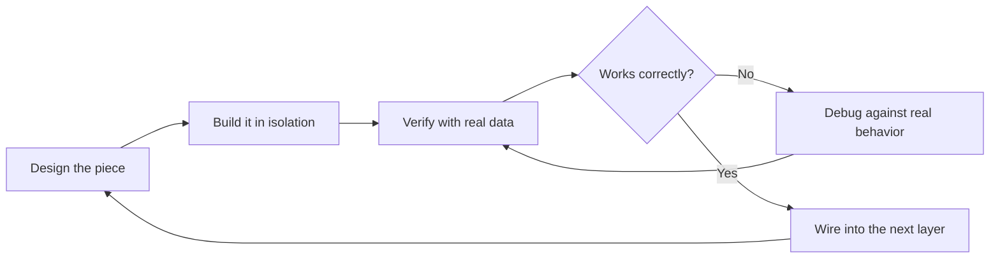
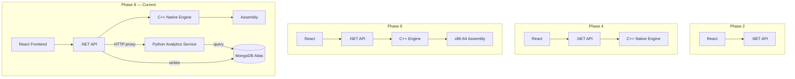

<div align="center">

# 📋 Project Status & Build Log

### System Performance & Monitoring Platform — Full Engineering History


[Roadmap](#-roadmap) • [Build Lifecycle](#-build-lifecycle) • [Phase Log](#-phase-log) • [Architecture Evolution](#-architecture-evolution) • [Metrics](#-performance-metrics) • [Next Steps](#-what-should-not-change)

---

</div>

## 🗺️ Roadmap

```
✅ ─ ✅ ─ ✅ ─ ✅ ─ ✅ ─ ✅ ─ ✅ ─ ✅ ─ ⬜ ─ ⬜
 1    2    3    4    5    6    7    8    9   10
```

| # | Phase | Layer | Status | Summary |
|:-:|---|---|:-:|---|
| 1 | Environment Setup | Tooling | ✅ | Toolchains verified across all 6 languages |
| 2 | Basic Application | React + .NET | ✅ | Full-stack pipeline proven end-to-end |
| 3 | System Monitoring | C# / Linux kernel | ✅ | Live metrics read directly from `/proc` |
| 4 | Native C++ Engine | C++ / P/Invoke | ✅ | Managed-to-native FFI bridge |
| 5 | Hardware Monitoring | C++ / sysfs | ✅ | GPU/thermal/fan, graceful degradation |
| 6 | Assembly | NASM x86-64 | ✅ | Hand-written scalar + SIMD benchmark |
| — | Cross-Platform Refactor | C# + C++ | ✅ | Linux/Windows provider abstraction |
| — | Optimization Pass | C# | ✅ | Caching, consolidation, parallelization |
| 7 | Python Analytics | Python / FastAPI | ✅ | Trend + bottleneck detection engine |
| 8 | Database | MongoDB Atlas | ✅ | Persistent snapshot storage |
| 9 | Dashboard UI | React | ⬜ | Visual analytics surfaced in-app |
| 10 | Maintenance & Extensibility | Cross-cutting | ⬜ | Hardening pass |

<br>

## 🔄 Build Lifecycle

Each phase in this project follows the same disciplined loop — no layer is added until the one below it is proven:



This loop is what caught every real bug documented below — the disk-`Infinity` crash, the duplicate GPU route, the CPU-startup-transient investigation, and the Phase 8 mixed-timestamp-type bug all surfaced because each new piece was checked against real output before the next was built on top of it.

<br>

## 🏛️ Architecture Evolution



The system grew one verified layer at a time — from a two-tier React/.NET app in Phase 2, to today's six-piece pipeline with a persistent analytics store.

<br>

## 🔍 Phase Log

<details open>
<summary><b>✅ Phase 1 — Environment Setup</b></summary>
<br>

**Goal:** prove every toolchain this project depends on actually works, before writing application code.

| Tool | Version |
|---|---|
| OS | Linux Mint 22.3 |
| .NET SDK | 10.0.111 |
| Node.js | v24.20 / npm 11.19 |
| git | 2.43 |
| GCC/G++ | 13.3 |
| gdb | 15.1 |
| cmake | 3.28.3 |
| nasm | 2.16.01 |

**Verification method:** each tool run standalone (`--version`, a trivial compile/build) before scaffolding the repo.

</details>

<details>
<summary><b>✅ Phase 2 — Basic Application</b></summary>
<br>

**Goal:** prove the React ↔ .NET pipeline before any real system data enters it.

- Vite + React + TypeScript frontend
- ASP.NET Core Web API backend
- CORS configured for local dev (`localhost:5173`)
- **Verification:** a live weather-forecast fetch round-tripped frontend → backend → frontend (later fully removed once Phase 3 replaced it with real system data)

</details>

<details>
<summary><b>✅ Phase 3 — System Monitoring</b></summary>
<br>

**Goal:** read real system metrics with zero wrapper libraries — no `psutil`, no shelling out to `top`.

| Metric | Source |
|---|---|
| CPU usage | `/proc/stat` |
| RAM | `/proc/meminfo` |
| Disk | `DriveInfo` |
| Network | `/proc/net/dev` |
| Processes | `/proc/[pid]/status` |

> 🐛 **Bug found & fixed:** an `Infinity`/JSON serialization crash on certain disk mounts (virtual filesystems reporting nonsensical sizes) — resolved with a `TotalSize > 0` filter and a `DriveFormat` exclusion list.

</details>

<details>
<summary><b>✅ Phase 4 — Native C++ Engine</b></summary>
<br>

**Goal:** establish a real managed-to-native bridge, not just a proof-of-concept stub.

- CMake-built shared library (`libsystemmonitor_native.so`)
- P/Invoke bridge from C# into C++
- **Verification:** a real hardware read (CPU model string, core count) round-tripped through the bridge, plus a direct C# vs C++ CPU-usage comparison — **87.2% vs 69.2%**, difference attributed to sampling-timing differences between the two measurement points, not a bridge bug.

</details>

<details>
<summary><b>✅ Phase 5 — Hardware Monitoring</b></summary>
<br>

*NVIDIA path implemented and tested · AMD path written but unverified on real hardware*

| Sensor | Method | Result |
|---|---|---|
| CPU temperature | sysfs thermal zone | **72°C confirmed** on real hardware |
| GPU vendor | Dynamic `/sys/class/drm` scan | Correctly found GPU on `card1`, not the assumed `card0` |
| GPU usage % | Vendor-conditional dispatch | AMD: real sysfs read; Intel/unknown: honest `"unavailable"` |
| Fan RPM | hwmon scan | Correctly reports unavailable — no fan sensor exposed on this laptop |
| Storage health | Basic tier only | Full SMART via `smartctl` deferred — needs root |

**Design principle established here and carried through the rest of the project:** missing sensors report `"unavailable"` honestly rather than returning fabricated data or crashing.

</details>

<details>
<summary><b>✅ Phase 6 — Assembly</b></summary>
<br>

**Goal:** hand-write real, measurable low-level performance code — not a toy example.

- NASM toolchain integrated via CMake's `ASM_NASM` language support
- Trivial constant-return function proved the toolchain end-to-end first
- Real CPU benchmark: a tight arithmetic loop, timed via `std::chrono` — **~240–300M ops/sec** on this Celeron 1017U
- SIMD (SSE2) implementation of the identical workload, compared directly against scalar:

| Implementation | Result |
|---|---|
| Scalar (general-purpose registers) | baseline |
| SIMD (SSE2, `XMM0–XMM7`) | **3.94–3.95× speedup** |
| Theoretical max (4-wide SIMD) | 4.0× |

A clean result within ~1.5% of the theoretical ceiling.

</details>

<details>
<summary><b>✅ Cross-Platform Refactor</b></summary>
<br>

**Goal:** decouple platform-specific system reads from the rest of the application.

**C# layer:** `ISystemInfoProvider` interface with independent `LinuxSystemInfoProvider` and `WindowsSystemInfoProvider` implementations, auto-selected at startup via `OperatingSystem.IsWindows()/IsLinux()`. `Program.cs` shrank from ~330 lines to ~40 as a result.

**C++ layer:** shared header (`native_engine.h`) + `common.cpp` (platform-independent logic) + `linux_provider.cpp` + `windows_provider.cpp`, with `CMakeLists.txt` picking the correct file via `if(WIN32)`.

Windows compiles cleanly on this toolchain; real-hardware verification is pending, since no Windows machine has been available to test on.

</details>

<details>
<summary><b>✅ Optimization Pass</b></summary>
<br>

**Goal:** remove latency that had already caused real debugging pain, before adding new features on top.

| Change | Before | After | Improvement |
|---|:-:|:-:|:-:|
| `native/build.sh` (chained cmake+make+cp) | manual, error-prone | one command | eliminated a repeat mistake |
| CPU endpoint (background cache) | ~200ms | **21ms** | ~10× faster |
| Network endpoint (background cache) | ~500ms | **28ms** | ~18× faster |
| Frontend polling | 5 requests / 2s cycle | **1 request** (`/api/system/all`) | 80% fewer requests |
| Process list (`Task.WhenAll`) | 947ms | **661ms** | ~30% faster |

</details>

<details>
<summary><b>✅ Phase 7 — Python Analytics</b></summary>
<br>

**Goal:** turn raw metric samples into actual insight — trend direction and bottleneck detection, not just live numbers.

Five staged, individually-verified steps:

| Step | File | What it does |
|:-:|---|---|
| 1 | `SnapshotLogger.cs` | Background service samples CPU/network, appends to a log |
| 2 | `analyze_snapshots.py` | Mean/min/max stats over a time window |
| 3 | `trend_analysis.py` | Rolling mean + least-squares linear trend (climbing/dropping/flat) |
| 4 | `bottleneck_detection.py` | Sustained-load episodes vs isolated spikes, classified `cpu_bound` / `combined_load` |
| 5 | `analytics_service.py` + `AnalyticsEndpoints.cs` | FastAPI service, proxied from .NET with graceful 503 degradation |

> 🐛 **Investigation, not a bug:** the first several CPU samples after startup consistently read 100%. Investigation traced this to genuine system load from .NET's own JIT compilation and Kestrel startup — the measurement code itself was correct. Fixed with a 3-second warm-up delay before sampling begins, rather than papering over it downstream.

</details>

<details>
<summary><b>✅ Phase 8 — Database <i>(MongoDB Atlas, not PostgreSQL)</i></b></summary>
<br>

> 🔄 **Decision:** switched from the originally-planned PostgreSQL to MongoDB Atlas mid-phase. An Atlas cluster was already available from an earlier project, and the existing JSONL snapshot shape maps onto Mongo documents with no relational schema design required. Trade-off knowingly accepted: gave up the relational/SQL learning value the original roadmap called out, in exchange for meaningfully less setup friction.

**Verification stages:**

| Stage | What was proven |
|:-:|---|
| 1 | Atlas connectivity from Python, before any app code changed |
| 2 | Manual insert + read-back — document shape confirmed correct |
| 3 | `SnapshotLogger.cs` → `InsertOne`, verified by watching the document count climb live |
| 4 | `analytics_service.py` → Mongo queries, `file` param removed from all endpoints |
| 5 | All three endpoints re-verified against **727+ real documents** |

> 🐛 **Bug found & fixed:** a leftover manual test document stored `timestamp` as an ISO string, while every real document (written via C#'s `DateTime.UtcNow`) stores a native Mongo datetime. The mixed types crashed the query loader (`AttributeError: 'str' object has no attribute 'tzinfo'`). Fixed by making the loader defensively handle both types, and deleting the stray test document. Same category of lesson as Phase 4's `nm -D` symbol-inspection bug: verify data-shape assumptions before trusting downstream code built on them.

✅ **Resolves both Phase 7 deferred items:** no unbounded flat file, no full-file re-parse on every request — replaced with an indexed, queryable store.

</details>

<details>
<summary><b>⬜ Phase 9 — Advanced Dashboard UI <i>(planned)</i></b></summary>
<br>

**Goal:** surface Phase 7/8 analytics visually in the actual product, not just via `curl`.

- [ ] Dedicated analytics panel in the React dashboard
- [ ] Live trend charts for CPU/network (from `/api/analytics/trend`)
- [ ] Bottleneck episode timeline, visually distinguishing `cpu_bound` vs `combined_load`
- [ ] Graceful "analytics unavailable" UI state on a 503 — not a broken panel
- [ ] Full data visibility: every field the API already returns should be reachable in the UI, not a partial summary

</details>

<details>
<summary><b>⬜ Phase 10 — Maintenance & Extensibility <i>(planned)</i></b></summary>
<br>

**Goal:** harden what already exists, rather than add new features.

- [ ] **MongoDB retention policy** — no TTL/expiry yet; collection will grow unbounded over time
- [ ] **Windows verification** — compiles, never executed end-to-end (blocked on hardware access)
- [ ] **AMD GPU verification** — blocked on hardware access
- [ ] **Full SMART storage health** — needs root, deferred
- [ ] **Automated tests** — everything verified manually so far; worth a real suite once the feature set stabilizes
- [ ] **Deployment hardening** — CORS currently hardcoded to `localhost:5173`, secrets via ad-hoc environment variables rather than a secrets manager, no CI/CD pipeline

</details>

<br>

## 📊 Performance Metrics

| Metric | Value |
|---|---|
| CPU benchmark throughput (scalar) | ~240–300M ops/sec |
| SIMD speedup over scalar | 3.94–3.95× |
| CPU endpoint latency (cached) | 21ms |
| Network endpoint latency (cached) | 28ms |
| Process list latency (parallelized) | 661ms |
| Frontend requests per poll cycle | 1 (was 5) |
| Languages in the pipeline | 6 (TS, C#, C++, ASM, Python, JS/HTML via frontend) |
| Analytics documents verified against | 727+ real MongoDB snapshots |

<br>

## 🧭 What Should Not Change

- The staged, **"prove it before adding the next layer"** discipline — carried through every phase without exception
- The **graceful-degradation pattern** — hardware reads, the analytics proxy, and database connection failures all report `"unavailable"`/`"degraded"` honestly instead of crashing or faking data
- `native/build.sh` as the only way to rebuild the native library
- Git commit timing remains the user's call

<br>

---

<div align="center">

See [`README.md`](./README.md) for the project overview and setup instructions.

</div>
