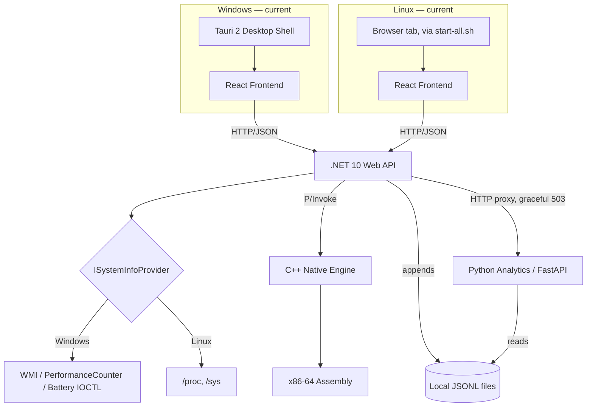

<div align="center">

# 📋 System Info — Engineering Status

**12 phases tracked · 10 fully done · 1 split by platform · 1 in progress · 1 discipline: prove every layer before building the next one**

`Linux Mint (primary dev)` · `Windows (Tauri desktop target)` · `.NET 10` · `React 19 + TypeScript` · `C++17` · `x86-64 Assembly` · `Python / FastAPI` · `Local JSON Lines`

</div>

---

## 📑 Contents

1. [Current State](#current-state)
2. [Current Architecture](#current-architecture)
3. [Backend Status](#backend-status)
4. [Frontend Status](#frontend-status)
5. [Windows Integration](#windows-integration)
6. [Hardware & Battery Monitoring](#hardware--battery-monitoring)
7. [Storage](#storage)
8. [API](#api)
9. [Speed Test](#speed-test)
10. [Build & Packaging](#build--packaging)
11. [Release Pipeline](#release-pipeline)
12. [Testing / Validation](#testing--validation)
13. [Known Limitations](#known-limitations)
14. [Historical Architecture](#historical-architecture)
15. [Phase Log](#phase-log)
16. [Performance Metrics](#performance-metrics)
17. [Remaining Work](#remaining-work)

---

## Current State

System Info is a cross-platform (Linux + Windows) system-monitoring application: a React/TypeScript dashboard backed by a .NET 10 API, a C++/Assembly native engine for hardware reads, and a Python/FastAPI analytics service, with all historical data stored in local JSON Lines files — no database of any kind is required to run the application today.

Distribution differs by platform:
- **Windows** — a native desktop app via Tauri 2 (`frontend/src-tauri/`), which wraps the frontend in a real window and manages the backend/analytics processes directly, packaged as an NSIS installer by CI.
- **Linux** — an AppImage or `.deb`, both of which still run the pre-Tauri model: `start-all.sh` starts the three services and the app is used from a browser tab.

The most recent substantive engineering pass (`CHANGELOG.md`'s `[2.1.0]` entry, sitting on top of the tagged `2.0.0` release) covered: the Tauri 2 migration itself, real Windows battery data via the battery class driver, removal of MongoDB in favor of local JSONL storage, a full seven-section dashboard redesign, and single-source version propagation across five version-bearing files.

---

## Current Architecture



This is the fourth architectural shape the project has taken (see [Historical Architecture](#historical-architecture) for the earlier three). The defining change from the previous shape is the Windows distribution model: a real native window with process-lifecycle ownership, replacing a self-contained console launcher that opened a browser tab.

---

## Backend Status

`backend/SystemMonitor.Api` — ASP.NET Core Minimal API, .NET 10.

| Component | Status | Notes |
|---|:-:|---|
| `ISystemInfoProvider` (Linux/Windows dispatch) | ✅ | Selected at startup via `OperatingSystem.IsWindows()`/`IsLinux()`; throws `PlatformNotSupportedException` on anything else |
| `SystemMonitorBackgroundService` | ✅ | Hosted service; samples CPU/network continuously after a 3s startup delay, caches in memory, appends each sample to the snapshot store |
| `ISnapshotStore` / `LocalJsonSnapshotStore` | ✅ | Append-only `data/snapshots/{yyyy}/{MM}/{dd}.jsonl`; malformed lines are skipped with a logged warning, not thrown |
| `AppDataPath` | ✅ | Resolves the writable data directory: `SYSTEM_INFO_DATA_DIR` override → `./data` in `Development` → `%LOCALAPPDATA%\SystemInfo\data` (Windows) / `~/.local/share/SystemInfo/data` (Linux) |
| Native P/Invoke bridge (`Native/NativeInterop.cs`) | ✅ | Calls into `libsystemmonitor_native.so`/`.dll` |
| CORS | ✅ | `http://localhost:5173` (Vite dev), `http://tauri.localhost` (Tauri 2 WebView2), `tauri://localhost` (non-Windows Tauri targets) |
| `HttpClient("AnalyticsService")` | ✅ | Named client, `http://localhost:8001`, 10s timeout |
| `GET /health` | ✅ | Dependency-free readiness probe for the Tauri process manager; deliberately outside `/api/system` |
| Static frontend hosting | ✅ | `UseStaticFiles` + `MapFallbackToFile("index.html")` against `wwwroot`, only when it exists (skipped in dev, where Vite serves the frontend separately) |

---

## Frontend Status

`frontend/src` — React 19, TypeScript, Vite 8.

| Component | Status | Notes |
|---|:-:|---|
| Seven dashboard sections (`components/views/`) | ✅ | Overview, Analytics, Processes, Storage, Network, Battery, System — routed from `App.tsx`'s `SECTIONS` array |
| Shared design-system primitives (`components/common/Primitives.tsx`) | ✅ | One spacing scale, one type scale, one card shape, one responsive grid |
| Live-freshness indicator | ✅ | `Live · updated Ns ago` → `Reconnecting` → `Offline`, driven by `useSystemMetrics` |
| Analytics time-range selector (1h/6h/24h/7d) | ✅ | Backed by `/api/analytics/*`'s `minutes`/`window` query params |
| `apiConfig.ts` centralized API base resolution | ✅ | Covers Vite dev server, Tauri desktop, and the legacy browser-hosted launcher, replacing three duplicated `API_BASE` constants |
| `ServiceControls.tsx` (Start/Stop/Exit) | ✅ | Only rendered inside the Tauri shell (`lib/tauri.ts` detects the runtime) |
| Empty-history / analytics-down states | ✅ | `TrendSummary`/`StatsSummary`/`BottleneckTimeline` treat every analytics field as optional, avoiding the fresh-install white-screen bug fixed in `2.1.0` |

---

## Windows Integration

| Component | Status | Notes |
|---|:-:|---|
| `frontend/src-tauri/` (Tauri 2 shell) | ✅ | Native window (`tauri.conf.json`: 1280×820, resizable, min 980×650) |
| `process.rs` service lifecycle | ✅ | Spawns backend (`:5132`) and analytics (`:8001`) as children, polls `/health` on each (30s timeout, 400ms interval) |
| Windows Job Object orphan hardening | ✅ (Windows only) | Each child gets its own Job with `KILL_ON_JOB_CLOSE`, specifically to catch a PyInstaller `--onefile` bootstrap's extracted interpreter process, which a plain `Child::kill()` can miss |
| Start/Stop/Exit UI (`commands.rs`, `ServiceControls.tsx`) | ✅ | Stop halts services, keeps window open; Exit and the native `X` both perform full shutdown; minimize/maximize never touch services |
| `WindowsSystemInfoProvider.GetBattery()` | ⚠️ Implemented, unverified | Reads charge %/charging state via `GetSystemPowerStatus`; reads capacity/voltage/health/cycle count via `WindowsBatteryInterop.cs`'s `IOCTL_BATTERY_QUERY_INFORMATION`/`IOCTL_BATTERY_QUERY_STATUS` calls. Falls back to an explicit "detailed query unavailable" note if the driver doesn't respond. **No Windows hardware test has been run against this code.** |
| GPU (DXGI) | ⚠️ Implemented, unverified | `native/CMakeLists.txt` explicitly links `dxgi` for the Windows build target; not hardware-verified |
| NSIS installer via `tauri build` | ✅ (CI) | `.github/workflows/release.yml`'s `build-windows` job stages backend/analytics into `frontend/src-tauri/resources/` and runs `tauri build` |
| Legacy launcher (`launcher/Program.cs`) & Inno Setup (`SystemInfo.iss`) | ❌ Deprecated | No longer part of the build; both files remain in the repo, headers marked deprecated, kept as a rollback reference only |

---

## Hardware & Battery Monitoring

| Metric | Linux | Windows |
|---|:-:|:-:|
| CPU model, core count, thermal zone | ✅ Tested | ⚠️ Implemented, unverified |
| CPU usage % (C# vs C++ cross-check) | ✅ Tested (87.2% vs 69.2%, timing-related, not a bridge bug) | ⚠️ Implemented, unverified |
| RAM, disk, network, processes | ✅ Tested | ⚠️ Implemented, unverified |
| GPU vendor detection | ✅ NVIDIA tested · ⚠️ AMD written, unverified | ⚠️ DXGI-linked, unverified |
| Fan RPM | ⚠️ Correctly reports unavailable (no hwmon sensor on the dev laptop) | ⚠️ Not implemented |
| Battery charge % / charging state | ✅ Tested (52% charge, discharging, 13.9W, confirmed live) | ✅ Implemented via `GetSystemPowerStatus` (not hardware-tested) |
| Battery capacity, voltage, health %, cycle count | ✅ Tested (77% health confirmed) | ⚠️ Implemented via battery IOCTL, **not hardware-tested** |
| Storage health (SMART) | 📌 Planned — needs root | 📌 Planned |

All sensor reads follow the same convention established in Phase 5: a missing or inaccessible sensor reports `"unavailable"` honestly rather than fabricating a value or throwing.

---

## Storage

- **Current:** `ISnapshotStore`/`LocalJsonSnapshotStore` — append-only `data/snapshots/{yyyy}/{MM}/{dd}.jsonl`, one file per day. Only the days a request actually needs are opened, so history can grow for months without slowing queries.
- **No retention/TTL policy** — `data/snapshots/` grows unbounded. Documented trade-off, not a bug.
- **No database of any kind is required** to run the application — this replaces the MongoDB Atlas architecture used through the `1.0.4.x` releases (see [Historical Architecture](#historical-architecture)).

---

## API

| Endpoint | Purpose | Notes |
|---|---|---|
| `GET /health` | Backend readiness probe | Used by the Tauri process manager |
| `GET /api/system/all` | Consolidated CPU/RAM/disk/network/battery/process snapshot | The frontend's single per-poll request |
| `GET /api/system/cpu`, `/ram`, `/disk`, `/network`, `/processes`, `/battery` | Individual metric reads | CPU/network served from the background cache |
| `GET /api/system/info` | Static host/CPU/OS identification | Fetched once, not polled |
| `GET /api/native/*` | Raw native-engine reads (cpuinfo, cputemp, gpu, fan, battery, asmtest, benchmark, simd-benchmark) | Debug/diagnostic surface over the P/Invoke bridge |
| `GET /api/analytics/stats` | Mean/min/max over a time window | Proxied to `analytics_service.py`, 503 on failure |
| `GET /api/analytics/trend` | Rolling mean + linear trend (climbing/dropping/flat) | Same proxy pattern |
| `GET /api/analytics/bottlenecks` | Sustained-load episodes vs. spikes, `cpu_bound`/`combined_load` | Same proxy pattern |
| `GET /api/speed-test` | Download/upload/ping measurement | — |

---

## Speed Test

Implemented and live under `GET /api/speed-test`, surfaced on the frontend via `SpeedTestCard.tsx`/`useSpeedTest.ts`. Any specific measured value recorded during development is a point-in-time result, not a guaranteed product capability — network speed test results are inherently environment-dependent.

---

## Build & Packaging

```
Source
  ↓
Frontend build (npm run build → frontend/dist)
  ↓
Backend build (dotnet publish, self-contained; frontend/dist copied into wwwroot)
  ↓
Native engine build (CMake + NASM → libsystemmonitor_native.so/.dll)
  ↓
Analytics build (PyInstaller → analytics executable, Windows only)
  ↓
Platform packaging:
  Windows → stage into frontend/src-tauri/resources/ → tauri build → NSIS installer
  Linux   → stage into AppDir/.deb layout → appimagetool / dpkg-deb
  ↓
Release artifact
```

`build.sh` (Linux dev machine) runs the frontend/backend/native stages locally as an 8-stage fail-fast pipeline and, on full success, execs `start-all.sh`. CI (`release.yml`) runs the equivalent stages independently for each platform.

---

## Release Pipeline

A single workflow, `.github/workflows/release.yml`, replaced an earlier 4-workflow chain (`build-windows-installer.yml`, `build-linux-installer.yml`, `create-release-tag.yml`, `create-release.yml`) that was linked via `workflow_run` events and had a permanent-lock bug: once a version's tag existed — even from a broken build — every subsequent push died at "tag already exists" forever.

The current pipeline:

1. **`version`** (ubuntu) — parses `CHANGELOG.md`'s top `## [x.y.z]` entry as the single source of truth; checks whether that version's tag already exists at this exact commit (skip), a different commit (hard error — versions are never overwritten), or not at all (proceed).
2. **`build-windows`** (windows-latest, `needs: version`) — syncs the version into all five version-bearing files via `scripts/sync-version.mjs` + `scripts/check-version.mjs`, builds the native engine, builds the frontend, embeds it into the backend's `wwwroot`, publishes the backend, stages everything into `frontend/src-tauri/resources/`, runs `tauri build`.
3. **`build-linux`** (ubuntu-latest, `needs: version`) — builds the native engine, backend, and frontend; stages a shared payload (`backend`, `frontend`, `native`, `analytics`, `assembly`, the root shell scripts); builds an AppImage and a `.deb`.
4. **`release`** (`needs: [build-windows, build-linux]`) — only runs if both builds succeeded; creates the git tag and the GitHub Release atomically via `softprops/action-gh-release`, attaching the NSIS installer, the AppImage, and the `.deb`.

**Verified working end-to-end** as of the `1.0.4` release (Windows + Linux builds, wwwroot embedding, and the new pipeline all succeeded). The Tauri-specific `build-windows` steps (Rust toolchain setup, `tauri build`, NSIS output) have not yet had an independent full-pipeline confirmation recorded beyond the migration author's own review of the workflow file.

---

## Testing / Validation

Everything in this project has been verified manually, phase by phase, against real output — no automated test suite exists (`tests/` is present but empty). Validation performed to date:

- Backend and frontend production builds (`dotnet build`, `npm run build`) — confirmed to succeed
- Individual API endpoints — confirmed via direct `curl` against real hardware output (e.g. `/api/system/all` returning a populated `battery` object)
- Native cross-compilation for Windows — verified in isolation using `mingw-w64`/`nasm` in a Linux sandbox, producing a real PE32+ DLL exporting all expected functions; this is not the same as a Windows-hosted build or runtime test
- Windows installer / runtime behavior — verified for the pre-Tauri (`1.0.4`) packaging model; **not yet independently re-verified for the current Tauri-based packaging**
- Windows battery IOCTL code and DXGI-linked GPU code — implemented, **not run on real Windows hardware**
- Dashboard UI — verified at 1280×720, 1366×768, 1920×1080, and 2560×1440, in both light and dark themes, with no horizontal overflow at any size; navigation confirmed to cause zero additional API requests across 14 tab switches

---

## Known Limitations

- Windows battery detail (capacity, voltage, health %, cycle count) and DXGI-based GPU reads are implemented but not hardware-verified.
- AMD GPU usage is written but unverified on real hardware; fan RPM is correctly reported unavailable on hardware without an exposed sensor.
- Cycle count is not guaranteed on any platform — some firmware reports `0` rather than a real count; the UI notes this explicitly rather than treating it as fact.
- Linux desktop packaging has not been migrated to Tauri — it still uses the `start-all.sh` browser-launch model.
- `trend_analysis.py` (battery, and by extension CPU/network trend logic) still reads a standalone `--file snapshots.jsonl` argument that hasn't existed since the move off MongoDB; it isn't reachable from `analytics_service.py` or the dashboard yet.
- Local snapshot storage has no retention/TTL policy — `data/snapshots/` grows unbounded, a known trade-off.
- Full SMART storage health needs root and isn't implemented; only basic disk capacity/usage is read today.
- No automated test suite exists.
- `CHANGELOG.md`'s `[2.1.0]` header is ahead of the version actually synced into `package.json`/`tauri.conf.json`/`Cargo.toml`/`Directory.Build.props`/`SystemInfo.iss` and the latest pushed git tag, all of which read `2.0.0`. This self-corrects the next time `release.yml` runs against the current `CHANGELOG.md`, which re-derives and re-syncs the version automatically — it is not a runtime bug, but it means the on-disk version-bearing files are not yet a reliable indicator of "the version in the changelog" until that next release runs.

---

## Historical Architecture

The project has gone through three earlier architectural shapes before the current one:

```
Shape 1 (Phases 2–6): Linux-only proof-of-concept
  React ↔ .NET, then C++ native engine, then Assembly — one verified layer at a time

Shape 2 (Cross-platform refactor): ISystemInfoProvider abstraction
  adds a Windows implementation alongside Linux, still no persistence

Shape 3 (Phase 8, MongoDB Atlas): adds persistent historical storage
  SnapshotLogger.cs → MongoDB Atlas; analytics_service.py queries Mongo
  — later fully replaced, not merely deprecated:
  Phase 8 originally targeted PostgreSQL per the roadmap, but the team
  switched to MongoDB Atlas mid-phase (an Atlas cluster was already
  available from another project, and the JSONL snapshot shape mapped
  onto Mongo documents with no relational schema design needed)

Shape 3.5 (Windows packaging v1): whole-repo Inno Setup installer
  requiring the end user to have Node/npm/Python/.NET SDK installed
  → replaced with a self-contained publish + a C# console launcher
  (launcher/Program.cs) that started the services and opened a browser tab

Shape 4 (current): local JSONL storage (MongoDB fully removed) +
  Tauri 2 native desktop shell on Windows, replacing the C# launcher's
  browser-tab model; Linux packaging (AppImage/.deb) still uses the
  pre-Tauri browser-launch model
```

Technologies that are **historical only** and must not appear in current setup instructions: MongoDB Atlas, `MONGO_URI`, PostgreSQL (planned for Phase 8, never implemented), the C# production launcher and Inno Setup installer as the *active* Windows build path (both files remain in the repo as an explicitly-marked rollback reference, not as part of the current build), and the 4-workflow `workflow_run`-chained release pipeline.

---

## Phase Log

| # | Phase | Layer | Status | Summary |
|:-:|---|---|:-:|---|
| 1 | Environment Setup | Tooling | ✅ Done | Toolchains verified across all languages before any application code |
| 2 | Basic Application | React + .NET | ✅ Done | React↔.NET pipeline proven with a throwaway weather-forecast round trip |
| 3 | System Monitoring | C# / Linux kernel | ✅ Done | Real metrics from `/proc/stat`, `/proc/meminfo`, `DriveInfo`, `/proc/net/dev`, `/proc/[pid]/status`. Bug found & fixed: an `Infinity`/JSON crash on virtual filesystem disk mounts, resolved with a `TotalSize > 0` filter |
| 4 | Native C++ Engine | C++ / P/Invoke | ✅ Done | CMake-built shared library, real P/Invoke bridge, cross-checked CPU usage 87.2% (C++) vs 69.2% (C#) — attributed to sampling-timing difference, not a bug |
| 5 | Hardware Monitoring | C++ / sysfs | ✅ Done | CPU temp confirmed at 72°C; GPU found via dynamic `/sys/class/drm` scan (not hardcoded `card0`); AMD path written but unverified; fan RPM correctly reports unavailable. Established the "unavailable, not fabricated" convention used throughout the rest of the project |
| 6 | Assembly | NASM x86-64 | ✅ Done | Scalar CPU benchmark (~240–300M ops/sec); SIMD (SSE2) measured at 3.94–3.95× speedup, within ~1.5% of the 4.0× theoretical ceiling |
| — | Cross-Platform Refactor | C# + C++ | ✅ Done | `ISystemInfoProvider` with Linux/Windows implementations, auto-selected via `OperatingSystem.Is*()`; `Program.cs` shrank from ~330 to ~40 lines |
| — | Optimization Pass | C# | ✅ Done | Background caching (CPU 200ms→21ms, network 500ms→28ms), consolidated polling (5 requests→1), parallelized process listing (947ms→661ms) |
| 7 | Python Analytics | Python / FastAPI | ✅ Done | `SnapshotLogger.cs` → `analyze_snapshots.py`/`trend_analysis.py`/`bottleneck_detection.py` → `analytics_service.py` + `AnalyticsEndpoints.cs` proxy with graceful 503. A 3s startup warm-up delay fixed a false-100%-CPU reading traced to .NET's own JIT/Kestrel startup load, not a measurement bug |
| 8 | Historical Storage | MongoDB Atlas → Local JSON Lines | ✅ Done | Originally MongoDB Atlas (727+ documents verified; one mixed-timestamp-type bug found and fixed defensively), later fully replaced with local JSONL files — no database, no `MONGO_URI`, no external service |
| 9 | Battery Health | C++ / sysfs / Win32 / React | ✅ Linux · ⚠️ Windows | Linux: dynamic `BAT*` discovery (this hardware reports `BAT1`, not `BAT0`), unit auto-detection (`CHARGE_*` vs `ENERGY_*`), consolidated JSON bridge, verified live (52% charge, discharging, 13.9W, 77% health). Windows: real IOCTL-based reads implemented, not hardware-tested |
| 10 | Advanced Dashboard UI | React | ✅ Done | Full redesign (not a restyle) around shared `Primitives.tsx`; seven sections; analytics range selector; trend/bottleneck visualization; live-freshness indicator; verified across 4 resolutions and both themes with zero extra fetches on navigation |
| 11 | Desktop Packaging (Tauri) | Rust / Tauri 2 | ✅ Windows · ⬜ Linux | Native window, managed service lifecycle with Windows Job Object hardening, Start/Stop/Exit controls, single-source version propagation. Replaces the C# launcher + Inno Setup path for Windows only — Linux packaging unchanged |
| 12 | Maintenance & Extensibility | Cross-cutting | 🔶 In Progress | See [Remaining Work](#remaining-work) |

---

## Performance Metrics

| Metric | Value |
|---|---|
| CPU benchmark throughput (scalar) | ~240–300M ops/sec |
| SIMD speedup over scalar | 3.94–3.95× |
| CPU endpoint latency (cached) | 21ms (was ~200ms) |
| Network endpoint latency (cached) | 28ms (was ~500ms) |
| Process list latency (parallelized) | 661ms (was 947ms) |
| Frontend requests per poll cycle | 1 (was 5) |
| Dashboard navigation extra fetches | 0 across 14 tab switches |
| Languages in the pipeline | 6 (TypeScript/Rust for the shell, C#, C++, x86-64 Assembly, Python) |
| Historical storage verified against | 727+ real snapshots (originally MongoDB Atlas; storage layer has since moved to local JSONL) |

---

## Remaining Work

- [ ] Hardware-verify the Windows battery IOCTL path and DXGI GPU reads on a real Windows machine
- [ ] Verify the AMD GPU sysfs path on real hardware
- [ ] Port `trend_analysis.py`'s battery/CPU/network trend logic into `analytics_service.py` so it's reachable from the dashboard (it currently only runs as a standalone CLI script against a file path that no longer exists)
- [ ] Re-run `scripts/sync-version.mjs`/CI's version sync against `CHANGELOG.md`'s current top entry so the on-disk version-bearing files match it
- [ ] Decide whether to bring Linux packaging onto Tauri or keep the `start-all.sh` browser-launch model as the permanent Linux distribution path
- [ ] Add a retention/TTL policy for `data/snapshots/`
- [ ] Implement full SMART storage health (needs root)
- [ ] Add an automated test suite
- [ ] Independently re-verify the full Windows release pipeline (Rust setup, `tauri build`, NSIS output) end to end, beyond the migration's own review of the workflow file

---

<div align="center">

See [`README.md`](./README.md) for the project overview and setup instructions.

</div>
