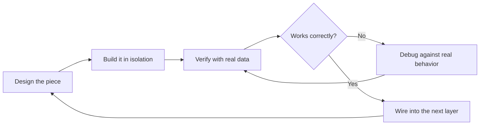
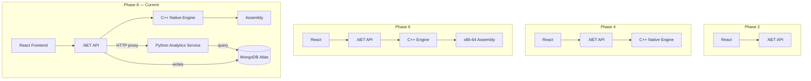

<div align="center">

# 📋 System Performance & Monitoring Platform
## Full Engineering Build Log

**9 of 11 phases complete · 1 in progress · 6 languages · 1 discipline: prove every layer before building the next one**

`Linux Mint 22.3` · `.NET 10` · `React + TypeScript` · `C++20` · `x86-64 Assembly` · `Python / FastAPI` · `MongoDB Atlas`

Last updated **2026-09-08**

</div>

---

## 📑 Contents

1. [🗺️ Roadmap](#roadmap)
2. [🔄 Build Discipline](#build-discipline)
3. [🏛️ Architecture, Then and Now](#architecture-then-and-now)
4. [🔍 Phase Log — every phase, in full](#phase-log)
5. [📊 Performance Metrics](#performance-metrics)
6. [🧭 What Should Not Change](#what-should-not-change)

---

## 🗺️ Roadmap

| # | Phase | Layer | Status | One-line summary |
|:-:|---|---|:-:|---|
| 1 | Environment Setup | Tooling | ✅ Done | Toolchains verified across all 6 languages |
| 2 | Basic Application | React + .NET | ✅ Done | Full-stack pipeline proven end-to-end |
| 3 | System Monitoring | C# / Linux kernel | ✅ Done | Live metrics read directly from `/proc` |
| 4 | Native C++ Engine | C++ / P/Invoke | ✅ Done | Managed-to-native FFI bridge |
| 5 | Hardware Monitoring | C++ / sysfs | ✅ Done | GPU/thermal/fan, graceful degradation |
| 6 | Assembly | NASM x86-64 | ✅ Done | Hand-written scalar + SIMD benchmark |
| — | Cross-Platform Refactor | C# + C++ | ✅ Done | Linux/Windows provider abstraction |
| — | Optimization Pass | C# | ✅ Done | Caching, consolidation, parallelization |
| 7 | Python Analytics | Python / FastAPI | ✅ Done | Trend + bottleneck detection engine |
| 8 | Database | MongoDB Atlas | ✅ Done | Persistent snapshot storage |
| 9 | Battery Health | C++ / sysfs / Python | ✅ Done | Charge/discharge status, health %, cycle count, live UI |
| 10 | Dashboard UI | React | 🔶 In Progress | Visual analytics surfaced in-app — layout & UI being reworked |
| 11 | Maintenance & Extensibility | Cross-cutting | ⬜ Planned | Hardening pass |

```
✅ ─ ✅ ─ ✅ ─ ✅ ─ ✅ ─ ✅ ─ ✅ ─ ✅ ─ ✅ ─ 🔶 ─ ⬜
 1    2    3    4    5    6    7    8    9   10   11
```

---

## 🔄 Build Discipline

Every phase below followed the same loop — no layer was added until the one underneath it was proven with real data.



This is the loop that caught every real bug in this log: the disk-`Infinity` crash in Phase 3, the duplicate-GPU-card discovery in Phase 5, the CPU-startup-transient investigation in Phase 7, and the mixed-timestamp-type bug in Phase 8. Every one of them surfaced because the new piece was checked against real output before anything was stacked on top of it.

---

## 🏛️ Architecture, Then and Now



The system grew one verified layer at a time — from a two-tier React/.NET app in Phase 2 to today's six-piece pipeline with a persistent analytics store.

---

## 🔍 Phase Log

Every phase, in full — nothing summarized away.

### ✅ 🧰 Phase 1 — Environment Setup
**Layer:** Tooling
**Goal:** prove every toolchain this project depends on actually works, before writing a single line of application code.

| Tool | Version |
|---|---|
| OS | Linux Mint 22.3 |
| .NET SDK | 10.0.111 |
| Node.js | v24.20 / npm 11.19 |
| git | 2.43 |
| GCC/G++ | 13.3 |
| gdb | 15.1 |
| cmake | 3.28.3 |
| nasm | 2.16.01 |

**Verification method:** each tool was run standalone (`--version`, a trivial compile/build) before the repo was even scaffolded.

---

### ✅ ⚛️ Phase 2 — Basic Application
**Layer:** React + .NET
**Goal:** prove the React ↔ .NET pipeline before any real system data enters it.

- Vite + React + TypeScript frontend
- ASP.NET Core Web API backend
- CORS configured for local dev (`localhost:5173`)

**Verification:** a live weather-forecast fetch round-tripped frontend → backend → frontend. It was later fully removed once Phase 3 replaced it with real system data.

---

### ✅ 🐧 Phase 3 — System Monitoring
**Layer:** C# / Linux kernel
**Goal:** read real system metrics with zero wrapper libraries — no `psutil`, no shelling out to `top`.

| Metric | Source |
|---|---|
| CPU usage | `/proc/stat` |
| RAM | `/proc/meminfo` |
| Disk | `DriveInfo` |
| Network | `/proc/net/dev` |
| Processes | `/proc/[pid]/status` |

**🐞 Bug found & fixed:** an `Infinity`/JSON serialization crash on certain disk mounts — virtual filesystems were reporting nonsensical sizes. Resolved with a `TotalSize > 0` filter and a `DriveFormat` exclusion list.

---

### ✅ ⚙️ Phase 4 — Native C++ Engine
**Layer:** C++ / P/Invoke
**Goal:** establish a real managed-to-native bridge, not just a proof-of-concept stub.

- CMake-built shared library (`libsystemmonitor_native.so`)
- P/Invoke bridge from C# into C++

**Verification:** a real hardware read (CPU model string, core count) round-tripped through the bridge, plus a direct C# vs C++ CPU-usage comparison — **87.2% vs 69.2%**, with the difference attributed to sampling-timing differences between the two measurement points, not a bridge bug.

---

### ✅ 🌡️ Phase 5 — Hardware Monitoring
**Layer:** C++ / sysfs
**Goal:** read real hardware sensors, and be honest when a sensor isn't there.

*NVIDIA path implemented and tested · AMD path written but unverified on real hardware*

| Sensor | Method | Result |
|---|---|---|
| CPU temperature | sysfs thermal zone | **72°C confirmed** on real hardware |
| GPU vendor | Dynamic `/sys/class/drm` scan | Correctly found GPU on `card1`, not the assumed `card0` |
| GPU usage % | Vendor-conditional dispatch | AMD: real sysfs read; Intel/unknown: honest `"unavailable"` |
| Fan RPM | hwmon scan | Correctly reports unavailable — no fan sensor exposed on this laptop |
| Storage health | Basic tier only | Full SMART via `smartctl` deferred — needs root |

**Design principle established here, carried through the rest of the project:** missing sensors report `"unavailable"` honestly rather than returning fabricated data or crashing.

---

### ✅ 🧮 Phase 6 — Assembly
**Layer:** NASM x86-64
**Goal:** hand-write real, measurable low-level performance code — not a toy example.

- NASM toolchain integrated via CMake's `ASM_NASM` language support
- Trivial constant-return function proved the toolchain end-to-end first
- Real CPU benchmark: a tight arithmetic loop, timed via `std::chrono` — **~240–300M ops/sec** on this Celeron 1017U
- SIMD (SSE2) implementation of the identical workload, compared directly against scalar

| Implementation | Result |
|---|---|
| Scalar (general-purpose registers) | baseline |
| SIMD (SSE2, `XMM0–XMM7`) | **3.94–3.95× speedup** |
| Theoretical max (4-wide SIMD) | 4.0× |

A clean result within ~1.5% of the theoretical ceiling.

---

### ✅ 🔀 Cross-Platform Refactor
**Layer:** C# + C++
**Goal:** decouple platform-specific system reads from the rest of the application.

**C# layer:** an `ISystemInfoProvider` interface with independent `LinuxSystemInfoProvider` and `WindowsSystemInfoProvider` implementations, auto-selected at startup via `OperatingSystem.IsWindows()` / `OperatingSystem.IsLinux()`. `Program.cs` shrank from ~330 lines to ~40 as a result.

**C++ layer:** a shared header (`native_engine.h`) plus `common.cpp` (platform-independent logic), `linux_provider.cpp`, and `windows_provider.cpp`, with `CMakeLists.txt` picking the correct file via `if(WIN32)`.

Windows compiles cleanly on this toolchain; real-hardware verification is still pending, since no Windows machine has been available to test on.

---

### ✅ ⚡ Optimization Pass
**Layer:** C#
**Goal:** remove latency that had already caused real debugging pain, before adding new features on top.

| Change | Before | After | Improvement |
|---|:-:|:-:|:-:|
| `native/build.sh` (chained cmake+make+cp) | manual, error-prone | one command | eliminated a repeat mistake |
| CPU endpoint (background cache) | ~200ms | **21ms** | ~10× faster |
| Network endpoint (background cache) | ~500ms | **28ms** | ~18× faster |
| Frontend polling | 5 requests / 2s cycle | **1 request** (`/api/system/all`) | 80% fewer requests |
| Process list (`Task.WhenAll`) | 947ms | **661ms** | ~30% faster |

---

### ✅ 📈 Phase 7 — Python Analytics
**Layer:** Python / FastAPI
**Goal:** turn raw metric samples into actual insight — trend direction and bottleneck detection, not just live numbers.

Five staged, individually-verified steps:

| Step | File | What it does |
|:-:|---|---|
| 1 | `SnapshotLogger.cs` | Background service samples CPU/network, appends to a log |
| 2 | `analyze_snapshots.py` | Mean/min/max stats over a time window |
| 3 | `trend_analysis.py` | Rolling mean + least-squares linear trend (climbing/dropping/flat) |
| 4 | `bottleneck_detection.py` | Sustained-load episodes vs isolated spikes, classified `cpu_bound` / `combined_load` |
| 5 | `analytics_service.py` + `AnalyticsEndpoints.cs` | FastAPI service, proxied from .NET with graceful 503 degradation |

**🔍 Investigation, not a bug:** the first several CPU samples after startup consistently read 100%. Traced to genuine system load from .NET's own JIT compilation and Kestrel startup — the measurement code itself was correct. Fixed with a 3-second warm-up delay before sampling begins, rather than papering over it downstream.

---

### ✅ 🗄️ Phase 8 — Database
**Layer:** MongoDB Atlas *(not PostgreSQL)*
**Goal:** move from an unbounded flat file to a persistent, queryable store.

**🔄 Decision:** switched from the originally-planned PostgreSQL to MongoDB Atlas mid-phase. An Atlas cluster was already available from an earlier project, and the existing JSONL snapshot shape maps onto Mongo documents with no relational schema design required. Trade-off knowingly accepted: gave up the relational/SQL learning value the original roadmap called out, in exchange for meaningfully less setup friction.

**Verification stages:**

| Stage | What was proven |
|:-:|---|
| 1 | Atlas connectivity from Python, before any app code changed |
| 2 | Manual insert + read-back — document shape confirmed correct |
| 3 | `SnapshotLogger.cs` → `InsertOne`, verified by watching the document count climb live |
| 4 | `analytics_service.py` → Mongo queries, `file` param removed from all endpoints |
| 5 | All three endpoints re-verified against **727+ real documents** |

**🐞 Bug found & fixed:** a leftover manual test document stored `timestamp` as an ISO string, while every real document (written via C#'s `DateTime.UtcNow`) stores a native Mongo datetime. The mixed types crashed the query loader (`AttributeError: 'str' object has no attribute 'tzinfo'`). Fixed by making the loader defensively handle both types, and deleting the stray test document. Same category of lesson as Phase 4's `nm -D` symbol-inspection bug: verify data-shape assumptions before trusting downstream code built on them.

**Resolves both Phase 7 deferred items:** no unbounded flat file, no full-file re-parse on every request — replaced with an indexed, queryable store.

---

### ✅ 🔋 Phase 9 — Battery Health
**Layer:** C++ / sysfs · C# · Python (partial) · React
**Goal:** extend the hardware-monitoring discipline from Phase 5 to the battery — real charge/discharge behavior and long-term health, not just a live percentage.

*Linux path implemented and verified end-to-end · Windows path deferred, same convention as the Cross-Platform Refactor's untested Windows branch*

| Piece | Status |
|---|---|
| Native discovery | `/sys/class/power_supply/*/type` scanned dynamically for the entry reporting `Battery` — same lesson as Phase 5's GPU discovery: this machine reports `BAT1`, not the commonly-assumed `BAT0`, and the code doesn't hardcode either |
| Unit handling | Detects `CHARGE_*` (µAh) vs `ENERGY_*` (µWh) sysfs fields at read time — this hardware reports `CHARGE_*`; a machine using the other convention is handled without a code change |
| Native → C# bridge | `get_battery_info_json()` in `linux_provider.cpp`, one consolidated JSON string per read (not 6 separate P/Invoke crossings), parsed into a typed `BatteryInfo` record in `LinuxSystemInfoProvider.cs` |
| Windows | `WindowsSystemInfoProvider.GetBattery()` stub returns `Available: false` with an explicit "not yet implemented" note — consistent with the AMD-usage/fan-RPM honesty convention already established on the Windows native side |
| Endpoints | Standalone `GET /api/system/battery`, folded into the existing consolidated `GET /api/system/all` alongside ram/cpu/disks/network |
| Persistence | `SnapshotLogger.Append` now takes an optional `BatteryInfo`; written into the Mongo snapshot document only when a battery is actually present — no fabricated field on desktops |
| Analytics (partial) | `trend_analysis.py` extended with charge-level trend, rolling mean, power-draw trend, and a time-to-empty estimate while discharging — reuses the exact same `linear_trend_slope`/`rolling_mean` functions proven on CPU/network, no new math. **Known gap, not battery-specific:** this script still reads a `--file snapshots.jsonl` path that hasn't existed since Phase 8's move to Mongo — CPU/network trend have the same gap. Porting this logic into `analytics_service.py` against Mongo is deferred to a future cleanup pass, tracked in Phase 11 |
| Frontend | Two Overview cards (Battery charge w/ inverted-severity coloring + sparkline, Battery health w/ cycle count) plus a dedicated **Battery** tab with capacity, device, and voltage detail panels |

**🔍 Design decision, not a bug:** cycle count reads `0` on this hardware's firmware — rather than trusting it as a real lifetime count, the UI surfaces an explicit note ("not all hardware tracks cycle count reliably") instead of presenting a suspicious zero as fact. Same honesty principle as every other sensor in this project.

**Verification:** confirmed live via `curl http://localhost:5132/api/system/all` returning a populated `battery` object, and visually in both the Overview cards and the new Battery tab against real hardware (52% charge, discharging, 13.9W draw, 77% health).

---

### 🔶 📊 Phase 10 — Advanced Dashboard UI *(in progress — layout & UI being remade)*
**Layer:** React
**Goal:** surface Phase 7/8/9 analytics visually in the actual product, not just via `curl`.

**Status update:** work has started on this phase, but the original layout/UI approach isn't being kept as-is — the dashboard is being remade with a reworked layout before the checklist below is fully checked off.

- [ ] Dedicated analytics panel in the React dashboard
- [ ] Live trend charts for CPU/network (from `/api/analytics/trend`)
- [ ] Bottleneck episode timeline, visually distinguishing `cpu_bound` vs `combined_load`
- [ ] Graceful "analytics unavailable" UI state on a 503 — not a broken panel
- [ ] Full data visibility: every field the API already returns should be reachable in the UI, not a partial summary
- [x] Battery health panel — Overview cards (charge, health) and a dedicated Battery detail tab, both live against real data
- [ ] Overall layout/UI remake — current version is being reworked, not final

---

### ⬜ 🛠️ Phase 11 — Maintenance & Extensibility *(planned)*
**Layer:** Cross-cutting
**Goal:** harden what already exists, rather than add new features.

- [x] **Setup wizard** (`setup.sh`) — checks all prerequisites, offers to install anything missing via apt, builds the native engine, installs frontend/analytics dependencies, and walks through setting `MONGO_URI` interactively. Safe to re-run any time.
- [x] **One-command launcher** (`start-all.sh`) — starts backend, analytics service, and frontend together, logging to `./logs/` instead of requiring 3+ manual terminals. Waits for each service to actually respond (polls the real "listening" state, not a fixed delay) before starting the next, and fails loudly with the relevant log's last 20 lines if a service doesn't come up in time. Verified end-to-end, including a real timing bug caught and fixed — an earlier fixed-delay version raced ahead of the .NET build and failed the first live test.
- [ ] **Real installer** (`.exe` / `.dmg`, double-clickable icon) — packaging so a non-technical user can install and run this without a terminal at all. A genuinely separate, larger effort from the launcher script above (Electron, Inno Setup, or similar).
- [ ] **MongoDB retention policy** — no TTL/expiry yet; collection will grow unbounded over time
- [ ] **Windows verification** — compiles, never executed end-to-end (blocked on hardware access); includes the Windows battery provider, currently a stub
- [ ] **AMD GPU verification** — blocked on hardware access
- [ ] **`trend_analysis.py` → Mongo port** — script still reads a `--file snapshots.jsonl` path that hasn't existed since Phase 8; CPU, network, and now battery trend logic all need porting into `analytics_service.py`'s Mongo-backed queries to actually be reachable from the dashboard
- [ ] **Full SMART storage health** — needs root, deferred
- [ ] **Automated tests** — everything verified manually so far; worth a real suite once the feature set stabilizes
- [ ] **Deployment hardening** — CORS currently hardcoded to `localhost:5173`, secrets via ad-hoc environment variables rather than a secrets manager, no CI/CD pipeline

---

## 📊 Performance Metrics

| Metric | Value |
|---|---|
| CPU benchmark throughput (scalar) | ~240–300M ops/sec |
| SIMD speedup over scalar | 3.94–3.95× |
| CPU endpoint latency (cached) | 21ms |
| Network endpoint latency (cached) | 28ms |
| Process list latency (parallelized) | 661ms |
| Frontend requests per poll cycle | 1 (was 5) |
| Languages in the pipeline | 6 (TS, C#, C++, ASM, Python, JS/HTML via frontend) |
| Analytics documents verified against | 727+ real MongoDB snapshots |

---

## 🧭 What Should Not Change

- The staged, **"prove it before adding the next layer"** discipline — carried through every phase without exception
- The **graceful-degradation pattern** — hardware reads, the analytics proxy, and database connection failures all report `"unavailable"`/`"degraded"` honestly instead of crashing or faking data
- `native/build.sh` as the only way to rebuild the native library
- Git commit timing remains the user's call

---

<div align="center">

See [`README.md`](./README.md) for the project overview and setup instructions.

</div>
