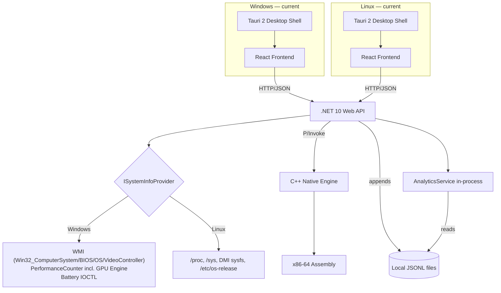

<div align="center">

# 📋 System Info — Engineering Status

**17 phases tracked · 14 fully done · 2 split by platform · 1 continuous ("maintenance & extensibility") · 1 discipline: prove every layer before building the next one**

`Linux Mint (primary dev)` · `Windows (Tauri desktop target)` · `.NET 10` · `React 19 + TypeScript` · `C++17` · `x86-64 Assembly` · `Rust (Tauri 2)` · `Local JSON Lines`

</div>

---

## 📑 Contents

1. [Current Architecture](#-current-architecture)
2. [Backend Status](#-backend-status)
3. [Frontend Status](#-frontend-status)
4. [Windows Desktop Integration](#-windows-desktop-integration)
5. [Hardware, GPU & Battery Monitoring](#-hardware-gpu--battery-monitoring)
6. [Storage](#-storage)
7. [API Surface](#-api-surface)
8. [Speed Test](#-speed-test)
9. [Languages Used](#-languages-used)
10. [Build & Packaging](#-build--packaging)
11. [Release Pipeline](#-release-pipeline)
12. [Version & Changelog Management](#-version--changelog-management)
13. [Testing / Validation](#-testing--validation)
14. [Known Limitations](#-known-limitations)
15. [Phase Log](#-phase-log)
16. [Performance Metrics](#-performance-metrics)
17. [Remaining Work](#-remaining-work)

---

## 🏗️ Current Architecture


```mermaid
flowchart TB
    subgraph Windows["Windows — current"]
        TW[Tauri 2 Desktop Shell] --> FEW[React Frontend]
    end
    subgraph Linux["Linux — current"]
        TL[Tauri 2 Desktop Shell] --> FEL[React Frontend]
    end
    FEW -- HTTP/JSON --> API[.NET 10 Web API]
    FEL -- HTTP/JSON --> API
    API --> PROV{ISystemInfoProvider}
    PROV -->|Windows| WINP["WMI (Win32_ComputerSystem/BIOS/OS/VideoController)\nPerformanceCounter incl. GPU Engine\nBattery IOCTL"]
    PROV -->|Linux| LINP["/proc, /sys, DMI sysfs, /etc/os-release"]
    API -- P/Invoke --> CPP[C++ Native Engine] --> ASM[x86-64 Assembly]
    API --> AN[AnalyticsService in-process]
    API -- appends --> STORE[(Local JSONL files)]
    AN -- reads --> STORE
```

This is the sixth architectural shape the project has taken (see [Historical Architecture](#-historical-architecture) for the earlier five). Shape 4 brought the Tauri native-window model to Windows only; Shape 5 brought Linux onto the same model — the `.deb`/AppImage install and run the Tauri shell directly (no `sudo`, no browser tab, no manual `localhost:5173`), replacing the `start-all.sh`-in-a-terminal production path. Shape 6 (2.3.0) removed the last non-.NET service: analytics now runs inside the backend, so the app starts exactly one child process (the full reasoning is in [Why Analytics Moved from Python to C#](#-why-analytics-moved-from-python-to-c)). `process.rs`, `commands.rs`, and the rest of the Rust shell were already fully cross-platform going into this pass (Windows-only bits like `win32job` were already `cfg(windows)`-gated) — what changed was the Linux CI job (`build-linux` in `release.yml`, previously a hand-rolled `dpkg-deb`/`appimagetool` script wrapping `start-all.sh`) and `tauri.conf.json`'s bundle targets/icons, not the shell's own logic.

---

## ⚙️ Backend Status

`backend/SystemMonitor.Api` — ASP.NET Core Minimal API, .NET 10.

| Component | Status | Notes |
|---|:-:|---|
| `ISystemInfoProvider` (Linux/Windows dispatch) | ✅ | Selected at startup via `OperatingSystem.IsWindows()`/`IsLinux()`; throws `PlatformNotSupportedException` on anything else |
| `SystemMonitorBackgroundService` | ✅ | Hosted service; samples CPU/network continuously after a 3s startup delay, caches in memory, appends each sample to the snapshot store. Sampling failures are logged once per distinct error and retried after a back-off (previously swallowed silently) |
| `SystemSnapshotService` (2.3.0) | ✅ | Builds `/api/system/all`: each subsystem runs off the request thread with its own 5 s timeout; a section still running from an earlier request is awaited rather than started again; concurrent requests share one scan and a result under 750 ms old is reused; a failed section is named in an additive `unavailable` array instead of failing the response; RAM falls back to the last good reading, or 503 if there has never been one |
| `AnalyticsService` (2.3.0) | ✅ | In-process stats/trend/bottleneck analysis over the JSONL history; same routes and JSON shape the Python service had; 5 s result cache; "all time" queries clamp to the oldest day on disk |
| `ISnapshotStore` / `LocalJsonSnapshotStore` | ✅ | Append-only `data/snapshots/{yyyy}/{MM}/{dd}.jsonl`; malformed lines are skipped with a logged warning, not thrown |
| `AppDataPath` | ✅ | Resolves the writable data directory: `SYSTEM_INFO_DATA_DIR` override → `./data` in `Development` → `%LOCALAPPDATA%\SystemInfo\data` (Windows) / `~/.local/share/SystemInfo/data` (Linux) |
| `GetSystemIdentity()` (both providers) | ✅ | Windows: `Win32_ComputerSystem`/`Win32_BIOS`/`Win32_OperatingSystem`, each query independently null-safe. Linux: DMI sysfs + `/etc/os-release` + `/proc/uptime` |
| `GetGpus()` (Windows) | ✅ | `Win32_VideoController` for every adapter + `GPU Engine` perf-counter sampling (200ms settle), engines attributed to adapters by `_phys_N_` instance-name parsing on multi-GPU systems |
| `GetGpus()` (Linux) | ⬜ | Returns empty — Linux GPU detection lives in the native engine's `/api/native/gpu` path instead, not yet unified into this interface |
| Native P/Invoke bridge (`Native/NativeInterop.cs`, `NativeKernels.cs`) | ✅ | Calls into `libsystemmonitor_native.so`/`.dll`; `NativeKernels`/`NativeHardware` are safe span-based wrappers with plain C# reference implementations; 64-bit quantities stay `long` across the boundary |
| Linux disk/battery providers (2.3.0) | ✅ | Disks: only real block-device volumes (RAM/loop/squashfs/bind mounts excluded; filesystem type from `/proc/mounts`). Battery: every field optional — a missing sysfs attribute is `null`, not an exception and not a 0 |
| Windows disk provider (2.3.0) | ✅ (not run on Windows) | Only fixed/removable drives, checked *before* `IsReady`, which can block for tens of seconds on a dead network share |
| Physical core count | ✅ | Native topology first (`GetLogicalProcessorInformationEx` / sysfs), WMI or `/proc/cpuinfo` as fallback |
| CORS | ✅ | `http://localhost:5173` (Vite dev), `http://tauri.localhost` (Tauri 2 WebView2), `tauri://localhost` (non-Windows Tauri targets) |
| `GET /health` | ✅ | Dependency-free readiness probe for the Tauri process manager; deliberately outside `/api/system` |
| Static frontend hosting | ✅ | `UseStaticFiles` + `MapFallbackToFile("index.html")` against `wwwroot`, only when it exists (skipped in dev, where Vite serves the frontend separately) |

---

## 🎨 Frontend Status

`frontend/src` — React 19, TypeScript, Vite 8.

| Component | Status | Notes |
|---|:-:|---|
| Seven dashboard sections (`components/views/`) | ✅ | Overview, Analytics, Processes, Storage, Network, Battery, System — routed from `App.tsx`'s `SECTIONS` array |
| Shared design-system primitives (`components/common/Primitives.tsx`) | ✅ | One spacing scale, one type scale, one card shape, one responsive grid, including a reused `Unavailable` component for any unsupported metric |
| Connection indicator | ✅ | `Live` → `Reconnecting` → `Offline`, driven by `useSystemMetrics` |
| Analytics time-range selector (1h/6h/24h/7d) | ✅ | Backed by `/api/analytics/*`'s `minutes`/`window` query params |
| `apiConfig.ts` centralized API base resolution | ✅ | Covers Vite dev server, Tauri desktop, and the legacy browser-hosted launcher, replacing three duplicated `API_BASE` constants |
| `ServiceControls.tsx` (Start/Stop/Exit) | ✅ | Only rendered inside the Tauri shell (`lib/tauri.ts` detects the runtime) |
| Empty-history / analytics-down states | ✅ | `TrendSummary`/`StatsSummary`/`BottleneckTimeline` treat every analytics field as optional, avoiding the fresh-install white-screen bug fixed in `2.1.0` |
| `useSystemInfo` bounded startup retry | ✅ | 300ms/600ms/1s/1.5s/2s backoff before surfacing a real error, with a manual Retry action — fixes the System tab getting permanently stuck on "Failed to fetch" after a normal cold start |
| `useSystemGpu` | ✅ | Polls `/api/system/gpu` on its own interval, independent of the CPU/RAM cycle, with its own scoped error state so a GPU read failure never blanks the rest of the System tab |
| GPU panel(s), System tab | ✅ | Renders one panel per detected adapter; active engines listed individually rather than summed |

---

## 🪟 Windows Desktop Integration

| Component | Status | Notes |
|---|:-:|---|
| `frontend/src-tauri/` (Tauri 2 shell) | ✅ | Native window (`tauri.conf.json`: 1280×820, resizable, min 980×650) |
| `supervisor.rs` + `process.rs` service lifecycle | ✅ | `supervisor.rs` is Tauri-free (spawn, readiness, exit detection, stale-process cleanup, cancellation) and unit-tested; `process.rs` resolves the packaged backend from the resource directory and builds the command. Spawns the backend (`:5132`), polls `/health` every 100 ms (45 s upper bound only), reports a crashed child immediately, refuses to treat a foreign process on the port as the backend, reaps a stale backend from an uncleanly terminated run (Linux, verified via `/proc/<pid>/exe`). `get_service_status` is lock-free; start/stop run off the UI thread; stage timings go to `logs/startup.log` |
| Windows Job Object orphan hardening | ✅ (Windows only) | The child gets its own Job with `KILL_ON_JOB_CLOSE`, so the backend dies with the app even on a crash |
| `commands.rs` — `start_services`/`stop_services`/`get_service_status`/`exit_app` | ✅ | The *entire* frontend-facing process-control surface; no `tauri-plugin-shell`, no generic command-execution capability |
| `CREATE_NO_WINDOW` on spawned children | ✅ | The backend no longer opens a visible console window on Windows (fixed in `2.1.1`) |
| Readiness polling | ✅ | A single bounded loopback `GET /health` with `std::net` — no HTTP client crate (`ureq` was removed in 2.3.0) |

---

## 🔋 Hardware, GPU & Battery Monitoring

**GPU — two independent detection paths exist:**

| Path | Platform | Route | What it returns |
|---|---|---|---|
| `ISystemInfoProvider.GetGpus()` | Windows | `GET /api/system/gpu` | Every adapter via `Win32_VideoController` (name, video processor, adapter memory, driver version/date, status, resolution, refresh rate) + live per-engine utilization from the `GPU Engine` performance-counter category |
| Native engine `get_gpu_vendor()` / `get_amd_gpu_usage_percent()` | Linux (primarily) | `GET /api/native/gpu` | Vendor detection via `/sys/class/drm` (dynamic scan, not hardcoded `card0`) and AMD usage via sysfs |

**Since 2.4.5** the GPU page uses a third, newer pipeline (`GpuService`, `/api/system/gpus/*`) that covers both platforms and any number of adapters; the two paths below remain for the System tab and the native endpoint. These have not yet been unified — the Windows path is the newer, more structured one; the native-engine path predates it and remains Linux's only GPU source.

**Battery:**

| Platform | Source | Status |
|---|---|---|
| Linux | Dynamic `BAT*` sysfs discovery, unit auto-detection (`CHARGE_*` vs `ENERGY_*`) | ✅ Verified live (52% charge, discharging, 13.9W, 77% health, on the reference dev machine) |
| Windows | `WindowsBatteryInterop.cs` — `IOCTL_BATTERY_QUERY_TAG`/`_INFORMATION`/`_STATUS` | ✅ Implemented, aggregated across multiple batteries — **not hardware-tested on real Windows hardware** |

**CPU topology, storage and fans (2.3.0):** native `si_get_cpu_topology` (physical/logical cores and packages; unknown is `-1`, never a guess), `si_get_storage_volume` (real block volumes, 64-bit sizes), `si_get_fan` (enumerates tachometers; Windows has no vendor-neutral fan API, so it honestly returns none). On the Linux development machine these matched `nproc`, `lscpu` and `df` exactly.

**Temperature & fan:** native engine, `/api/native/cputemp` and `/api/native/fan`. ACPI thermal-zone data is never presented as CPU/GPU temperature without a verified mapping; a missing fan sensor correctly reports `Unavailable`, not `0`.

---

## 📦 Storage

**Before → Why → Now**, in detail:

| | |
|---|---|
| **Before** | `SnapshotLogger.cs` wrote documents to **MongoDB Atlas**; the (then Python) analytics service queried Mongo directly; a `MONGO_URI` connection string (originally planned as PostgreSQL, switched mid-phase to an already-available Atlas cluster) had to be configured before analytics worked at all. |
| **Why it changed** | An external database added an account dependency and a network requirement to what is otherwise a fully local, offline-capable desktop application. |
| **Now** | `ISnapshotStore` / `LocalJsonSnapshotStore` — append-only `data/snapshots/{yyyy}/{MM}/{dd}.jsonl`, resolved by `AppDataPath.cs` (`./data` in dev, `%LOCALAPPDATA%\SystemInfo\data` on Windows, `~/.local/share/SystemInfo/data` on Linux). `AnalyticsService` reads the `.jsonl` files for the requested range directly (an "all time" query is clamped to the oldest day that has data); malformed lines are skipped and logged, not thrown. The reasoning behind the analytics side of this change is in [Why Analytics Moved from Python to C#](#-why-analytics-moved-from-python-to-c). |

No retention/TTL policy exists yet — `data/snapshots/` grows unbounded (documented trade-off, not a bug).

---

## 🔌 API Surface

| Group | Routes | Backing |
|---|---|---|
| Health | `GET /health` | Static, no dependencies |
| System (live) | `GET /api/system/{all,cpu,ram,disk,network,processes,battery}` | `ISystemInfoProvider` + `SystemMonitorBackgroundService` cache; `/all` goes through `SystemSnapshotService` (per-section timeouts, partial results, `unavailable` list) |
| System (static) | `GET /api/system/info`, `GET /api/system/gpu` | `ISystemInfoProvider.GetSystemIdentity()` / `.GetGpus()` |
| Analytics | `GET /api/analytics/{stats,trend,bottlenecks}` | Computed in-process by `AnalyticsService.cs` from the JSONL history (5 s cache); 503 only if the data directory is unreadable |
| Native diagnostics | `GET /api/native/{test,cpuinfo,cpufeatures,kernels,topology,storage,fans,memory-bandwidth,cpu,cputemp,gpu,battery,fan,benchmark,asmtest,simd-benchmark}` | P/Invoke into the C++/Assembly native engine |
| Speed test | `GET /api/speed-test` | Server-side Cloudflare-based measurement — **implemented, not currently called by the frontend** (see [Speed Test](#-speed-test)) |

---

## ⚡ Speed Test

`SpeedTestCard.tsx` / `useSpeedTest.ts` perform the download/upload/ping measurement **client-side**, directly against `https://speed.cloudflare.com`, bypassing the local backend entirely so results aren't skewed by a loopback hop. `backend/SystemMonitor.Api/Endpoints/SpeedTestEndpoints.cs` implements an equivalent server-side measurement (10 MB download / 5 MB upload against the same Cloudflare endpoints) at `GET /api/speed-test`, fully functional, but it is not currently wired into the frontend — both paths exist in the repository, only one is in active use.

---

## 💻 Languages Used

Application/source languages present in the repository, by area:

| Area | Languages |
|---|---|
| Frontend | TypeScript, JavaScript, CSS, HTML |
| Backend API | C# |
| Desktop shell (Tauri) | Rust |
| Native hardware engine | C++, x86-64 Assembly (NASM), CMake |
| Analytics | C# (in-process, `AnalyticsService`) |
| Automation / dev scripts | Bourne Shell, PowerShell |

---

## 🛠️ Build & Packaging

**Before:** a whole-repository Inno Setup installer (`SystemInfo.iss`) requiring a full development toolchain on the end-user machine → replaced by a self-contained `dotnet publish` plus a C# console launcher (`launcher/Program.cs`) that started the services and opened a browser tab → replaced again by the current Tauri 2 model.

**Now:** CI stages the backend build output into `frontend/src-tauri/resources/backend/` and runs `tauri build`, which produces the app and its installer in one step. Only the backend is staged — there is no analytics executable and no Python build step. The Inno Setup installer, the C# launcher, their documentation and the legacy Linux `AppRun`/desktop file were deleted in 2.3.0 after confirming nothing referenced them. `setup.*` and `start-all.*` remain as developer-only tooling and their headers now say so.

---

## 🚀 Release Pipeline

`.github/workflows/release.yml`, five jobs (the `tests` job is the reusable `tests.yml`, which also runs on its own for every pull request and non-`main` push):

```
push to main (with a new top CHANGELOG.md entry)
        │
        ▼
   ┌─────────┐
   │ version │  parses CHANGELOG.md's top "## [x.y.z]" entry,
   └────┬────┘  checks whether that tag already exists
        │
   ┌────┴────┐
   ▼         │
┌───────┐    │  tests.yml: ctest (Linux + Windows/MSVC),
│ tests │    │  C# tests, Rust supervisor tests
└───┬───┘    │
    └────┬───┘
   ┌─────┴────────────────┐
   ▼                       ▼
┌───────────────┐   ┌───────────────┐
│ build-windows │   │  build-linux  │
│ native → .NET │   │ native → .NET │
│ → frontend →  │   │ → frontend →  │
│ tauri build   │   │ tauri build   │
│ (NSIS)        │   │ (deb/AppImage)│
└───────┬───────┘   └───────┬───────┘
        └──────────┬────────┘
                    ▼
              ┌───────────┐
              │  release  │  extracts that version's section from
              └───────────┘  CHANGELOG.md, publishes GitHub Release
```

Both build jobs follow the same shape: native engine → self-contained backend publish → frontend build → stage the backend as a Tauri resource → `tauri build`, and neither starts until `tests` has passed (native/Assembly ctest on Linux and Windows/MSVC, the C# suite, the Rust supervisor suite). The AppImage's bundle-type stamp is applied with a short Node script (Node is already installed in that job), so no scripting runtime beyond Node is needed anywhere in CI. Both validate the staged resources are present and non-empty, and that `tauri.conf.json` doesn't leak the runner's absolute checkout path, before uploading their installer artifact(s). The `release` job's release-notes extraction (`awk` against `## [$VERSION]`) requires that version's section to still be present in `CHANGELOG.md` — i.e. release before archiving it with `scripts/archive-changelog.mjs`, not after.

---

## 🔢 Version & Changelog Management

**Version sync:** `scripts/sync-version.mjs` propagates `CHANGELOG.md`'s top version to `frontend/package.json`, `frontend/src-tauri/tauri.conf.json`, `frontend/src-tauri/Cargo.toml` and `Directory.Build.props`. `scripts/check-version.mjs` fails loudly if any of them drift — this is what CI runs, and it currently passes clean at `2.3.0` across all four files. (It was five files until the Inno Setup script was deleted.)

**Changelog archiving (new this pass):** `scripts/archive-changelog.mjs` keeps `CHANGELOG.md` to `[Unreleased]` + the 2 most recent releases; everything older is moved, verbatim and newest-first, into `CHANGELOG_ARCHIVE.md`. Run manually after cutting a release — not wired into CI. Verified not to interfere with `check-version.mjs` or `release.yml`'s version detection, since both only ever read `CHANGELOG.md`'s top entry, which this script never removes.

---

## ✅ Testing / Validation

- Native cross-compilation for Windows — verified in isolation using `mingw-w64`/`nasm` in a Linux sandbox, producing a real PE32+ DLL exporting all expected functions; this is not the same as a Windows-hosted build or runtime test
- Windows installer / runtime behavior — verified for the pre-Tauri (`1.0.4`) packaging model; **not yet independently re-verified for the current Tauri-based packaging**
- Linux `.deb`/AppImage packaging via `tauri build` (this pass) — reviewed against the Windows job it mirrors and against Tauri's own documented Linux build prerequisites (`libwebkit2gtk-4.1-dev` etc.), and the Rust shell's Linux code paths (`process.rs`'s `cfg(not(windows))` branches, `data_root()`, executable-name resolution) were already exercised by `tauri dev` reasoning; **the actual `release.yml` `build-linux` job has not been run on real GitHub Actions infrastructure, and the resulting `.deb`/`.AppImage` have not been installed/launched on a real Linux machine**
- Windows battery IOCTL code, DXGI-linked GPU code, and the new `Win32_VideoController`/`GPU Engine` GPU support — implemented, **not run on real Windows hardware**
- Dashboard UI — verified at 1280×720, 1366×768, 1920×1080, and 2560×1440, in both light and dark themes, with no horizontal overflow at any size; navigation confirmed to cause zero additional API requests across 14 tab switches (pre-GPU-panel baseline)
- `useSystemInfo`'s bounded retry and the frontend TypeScript for the GPU/System-Identity work — `tsc -b` and `oxlint` both clean; **not build-verified on the .NET side** (no `dotnet`/Windows toolchain available in the environment that wrote it)
- **Automated tests (2.3.0):** native/Assembly ctest (every SSE2/AVX2 kernel vs a C++ reference at lengths 0–4099 with misaligned pointers, `memcpy` guard bytes, topology/storage/fan sanity, argument validation, the SIMD zero-iteration regression); 458 C# checks (analytics maths and JSON shape, torn lines, empty history, a full 86,400-row day, cancellation, managed native wrappers vs C# references); 6 Rust supervisor tests against a std-only fake service. All three run in CI (`tests.yml`) and gate releases. Each new Assembly kernel was mutation-tested — a deliberately broken kernel made the self-test fail.
- **Run for real, on Linux, in the authoring environment:** the native tests natively and as a Windows x64 build under Wine; the C# suite on .NET 8; the actual backend started and every new/changed endpoint exercised (ready in about 1.2 s on a JIT development build); `tsc -b` clean.
- **Still not run anywhere real:** an installed Windows/`.deb`/AppImage build; `tauri build`; the Windows-only C# (WMI provider and the drive-type change — compiled only by CI); the Windows native tests on MSVC; before/after startup timings

---

## 🔄 In-App Updates (added 2.2.0)

Implemented: automatic check at startup + every 6 h, manual check, Updates tab (installed vs new release notes, progress, optional auto-install), clean stop → install → relaunch sequence with service recovery on failure, minisign-signed installers, `latest.json` generated in `release.yml`'s `release` job and verified after publish, AppImage bundle-type stamping, release preflight for key/secret. See README "In-App Updates" for one-time key setup.

Not yet verified on real machines: the full download/install/relaunch cycle on Windows and Linux against a real Release (signing + signature verification were verified locally with a throwaway key; Rust compiles; frontend builds).

## ⚠️ Known Limitations

- Windows battery detail (capacity, voltage, health %, cycle count), DXGI-based GPU reads, and the new `Win32_VideoController`/`GPU Engine` GPU code are implemented but not hardware-verified.
- AMD GPU usage (native engine, Linux) is written but unverified on real hardware; fan RPM is correctly reported unavailable on hardware without an exposed sensor.
- GPU detection is split across two unreconciled paths — the structured Windows `ISystemInfoProvider.GetGpus()` path and the older native-engine `/api/native/gpu` path (Linux's only GPU source). These have not been unified into one interface.
- Multi-GPU engine-to-adapter attribution on Windows relies on parsing the `_phys_N_` segment of the performance counter's instance name — unverified against a real dual-GPU (integrated + discrete) Windows laptop.
- Cycle count is not guaranteed on any platform — some firmware reports `0` rather than a real count; the UI notes this explicitly rather than treating it as fact.
- Linux desktop packaging now goes through the same Tauri pipeline as Windows (`tauri build` producing `.deb`/`.AppImage`) — implemented and reviewed, but not yet run against real GitHub Actions infrastructure or a real Linux machine (see Testing/Validation).
- Battery trend analysis was part of the old Python scripts but never reachable from the dashboard or the HTTP API, so it was **not** ported when analytics moved to C#. If wanted, it is a small addition to `AnalyticsService`.
- Analytics over multi-day windows reads every snapshot line on a cache miss. One day (86,400 rows) took roughly 0.65–1.1 s cold in testing; a 7-day window is extrapolated, not measured, and is probably several seconds. A cached repeat is instant (5 s TTL). Down-sampling or rolling pre-aggregates would fix it if it matters.
- `SpeedTestEndpoints.cs`'s server-side `/api/speed-test` is fully implemented but not called by the frontend, which measures client-side instead — dead-but-functional code, not a bug, but worth reconciling one way or the other.
- Local snapshot storage has no retention/TTL policy — `data/snapshots/` grows unbounded, a known trade-off.
- Full SMART storage health needs root and isn't implemented; only basic disk capacity/usage is read today.
- There are no frontend tests, and no automated test runs an *installed* build. `docs/` and `database/` are empty placeholder directories.
- No `LICENSE` file is present in the repository.

---

## 🗂️ Phase Log

| # | Phase | Layer | Status | Summary |
|:-:|---|---|:-:|---|
| 1 | Environment Setup | Tooling | ✅ Done | Toolchains verified across all languages before any application code |
| 2 | Basic Application | React + .NET | ✅ Done | React↔.NET pipeline proven with a throwaway weather-forecast round trip |
| 3 | System Monitoring | C# / Linux kernel | ✅ Done | Real metrics from `/proc/stat`, `/proc/meminfo`, `DriveInfo`, `/proc/net/dev`, `/proc/[pid]/status`. Bug found & fixed: an `Infinity`/JSON crash on virtual filesystem disk mounts, resolved with a `TotalSize > 0` filter |
| 4 | Native C++ Engine | C++ / P/Invoke | ✅ Done | CMake-built shared library, real P/Invoke bridge, cross-checked CPU usage 87.2% (C++) vs 69.2% (C#) — attributed to sampling-timing difference, not a bug |
| 5 | Hardware Monitoring | C++ / sysfs | ✅ Done | CPU temp confirmed at 72°C; GPU found via dynamic `/sys/class/drm` scan (not hardcoded `card0`); AMD path written but unverified; fan RPM correctly reports unavailable. Established the "unavailable, not fabricated" convention used throughout the rest of the project |
| 6 | Assembly | NASM x86-64 | ✅ Done | Scalar CPU benchmark (~240–300M ops/sec); SIMD (SSE2) measured at 3.94–3.95× speedup, within ~1.5% of the 4.0× theoretical ceiling |
| — | Cross-Platform Refactor | C# + C++ | ✅ Done | `ISystemInfoProvider` with Linux/Windows implementations, auto-selected via `OperatingSystem.Is*()`; `Program.cs` shrank from ~330 to ~40 lines |
| — | Optimization Pass | C# | ✅ Done | Background caching (CPU 200ms→21ms, network 500ms→28ms), consolidated polling (5 requests→1), parallelized process listing (947ms→661ms) |
| 7 | Analytics (Python → C#) | Python / FastAPI → C# | ✅ Done — moved in-process in 2.3.0 | **Original (Python):** `SnapshotLogger.cs` → `analyze_snapshots.py`/`trend_analysis.py`/`bottleneck_detection.py` → `analytics_service.py` + `AnalyticsEndpoints.cs` proxy with graceful 503. A 3s startup warm-up delay fixed a false-100%-CPU reading traced to .NET's own JIT/Kestrel startup load, not a measurement bug. **Later:** the service switched from MongoDB to local JSONL files, then was ported into the backend as `AnalyticsService` and the Python removed entirely — see [Why Analytics Moved from Python to C#](#-why-analytics-moved-from-python-to-c) |
| 8 | Historical Storage | MongoDB Atlas → Local JSON Lines | ✅ Done | Originally MongoDB Atlas (727+ documents verified; one mixed-timestamp-type bug found and fixed defensively), later fully replaced with local JSONL files — no database, no `MONGO_URI`, no external service |
| 9 | Battery Health | C++ / sysfs / Win32 / React | ✅ Linux · ⚠️ Windows | Linux: dynamic `BAT*` discovery (this hardware reports `BAT1`, not `BAT0`), unit auto-detection (`CHARGE_*` vs `ENERGY_*`), consolidated JSON bridge, verified live (52% charge, discharging, 13.9W, 77% health). Windows: real IOCTL-based reads implemented, not hardware-tested |
| 10 | Advanced Dashboard UI | React | ✅ Done | Full redesign (not a restyle) around shared `Primitives.tsx`; seven sections; analytics range selector; trend/bottleneck visualization; live-freshness indicator; verified across 4 resolutions and both themes with zero extra fetches on navigation |
| 11 | Desktop Packaging (Tauri) | Rust / Tauri 2 | ✅ Windows · ✅ Linux | Native window, managed service lifecycle with Windows Job Object hardening (Linux: kill + pid-file reaper since 2.3.0), Start/Stop/Exit controls, single-source version propagation. Replaces the C# launcher + Inno Setup path on Windows and the `start-all.sh`-in-a-terminal path on Linux; the Rust shell itself needed no changes for Linux — only `release.yml`'s `build-linux` job and `tauri.conf.json`'s bundle config did. Not yet run on real CI or real Linux hardware |
| 12 | GPU & Extended System Identity | C# / WMI | ✅ Windows · ⬜ Linux (`ISystemInfoProvider`) | `Win32_VideoController` + `GPU Engine` perf counters; `Win32_ComputerSystem`/`Win32_BIOS`/`Win32_OperatingSystem`. Fixed the System tab's permanent "Failed to fetch" via bounded retry. Not build-verified on Windows (no `dotnet` toolchain in the authoring environment) |
| 13 | Maintenance & Extensibility | Cross-cutting | 🔶 In Progress | `CHANGELOG.md`/`CHANGELOG_ARCHIVE.md` split shipped this pass. See [Remaining Work](#-remaining-work) for the rest |
| 14 | Linux Desktop Packaging (Tauri) | Rust / Tauri 2 / CI | ✅ Done (unverified on real CI/hardware) | Brought Linux onto the same Tauri packaging model as Windows. Root cause of the original bug reports: `build-linux` staged `start-all.sh` — a dev script assuming a writable `/opt/systeminfo/logs` and a system-wide `uvicorn` — into the `.deb`, which is what produced the `Permission denied` and `uvicorn: command not found` errors. `process.rs`/`commands.rs`/`lib.rs` needed no changes (already fully cross-platform); fixed `tauri.conf.json` (`targets` → `["nsis","deb","appimage"]`, added a generated Linux/macOS icon set via `tauri icon`, Linux bundle config) and rewrote `build-linux` to mirror `build-windows`: self-contained `linux-x64` backend publish, a frozen analytics binary (since removed — see the Python→C# section), staged as Tauri resources, then `tauri build`. Added Tauri's Linux build prerequisites (`libwebkit2gtk-4.1-dev` etc.) to the CI apt install step. `packaging/linux/AppRun` and `systeminfo.desktop` marked deprecated (Tauri generates its own) |
| 15 | Startup & Process Supervision | Rust / Tauri / .NET | ✅ Done (not run from a real installer) | Found the cause of the "installed app freezes after double-click" report in source: the supervisor held a lock across the readiness wait while the UI thread's status call needed the same lock. Rewrote it as a Tauri-free, tested supervisor: no lock held while waiting, immediate crash detection, busy-port detection, stale-process reaping, concurrent start of all services, off-UI-thread start/stop, `startup.log` with timings. Backend: `SystemSnapshotService` (per-subsystem isolation for `/api/system/all`), logged sampler failures, warm-up, ReadyToRun publish. Provider fixes (Linux disks/battery, Windows drive types, native-first core count) |
| 16 | Native & Assembly Expansion | C++ / NASM / C# | ✅ Done (Linux verified; Windows build verified under Wine; not on real Windows) | CPU feature detection with CPUID **and** XGETBV (so a CPU feature the OS has masked is never used); SSE2/AVX2 kernels for vector add, dot, int32 sum/min/max, memcpy and XOR checksum with scalar tails and runtime dispatch; `si_kernel_selftest` against C++ references with boundary lengths, misaligned pointers and guard bytes, mutation-tested; topology, storage and fan enumeration; memory-bandwidth benchmark; fixed the SIMD-loop hang for n < 4; exception-free native filesystem access; safe span-based C# wrappers with C# references |
| 17 | Python Retired | C# / CI / docs | ✅ Done (2.3.0) | Analytics ported to `AnalyticsService`; Python source, proxy, port 8001, PyInstaller/pip CI steps and Python handling in the dev scripts deleted; tests and CI stamping no longer use Python; releases gated on `tests.yml`. See [Why Analytics Moved from Python to C#](#-why-analytics-moved-from-python-to-c) |
| 18 | RAM Monitoring (2.4.0) | C++ / C# / React | ✅ Done (Linux verified; Windows native build verified under Wine; not on real Windows) | Runtime RAM (`RamDetails`, bytes, nullable unknowns) separated from physical memory (`MemoryHardwareSummary` + `MemoryModule[]`, SMBIOS Type 16/17) and memory health (EDAC). New RAM tab with per-section loading/partial/error states. Shared byte-buffer SMBIOS parser with a Linux file loader and a Windows `GetSystemFirmwareTable` loader; `smbios_parse_test` (195 checks) and `smbios_loader_test` (26 checks). Channel mode intentionally always "Unknown"; ECC enabled never guessed. |
| 19 | GPU page (2.4.5) | C# / React | ✅ Done (Linux unit-tested with a fake sysfs/NVML; not run on real GPUs or on Windows) | One card per adapter; `services/Gpu/` collectors for Linux (DRM/sysfs) and Windows (WMI/DXGI/perf counters), NVIDIA via NVML, cached adapter list, `/api/system/gpus/hardware` + `/live` |

---

## 📊 Performance Metrics

| Metric | Value |
|---|---|
| CPU benchmark throughput (scalar) | ~240–300M ops/sec |
| SIMD speedup over scalar | 3.94–3.95× |
| CPU endpoint latency (cached) | 21ms (was ~200ms) |
| Network endpoint latency (cached) | 28ms (was ~500ms) |
| Process list latency (parallelized) | 661ms (was 947ms) |
| Analytics, one day of history (86,400 rows), cold | ~0.65–1.1 s in testing on the Linux dev machine; repeat requests within 5 s are served from cache |
| Backend ready (`/health`), Linux, JIT development build | ~1.2 s in one run; a ReadyToRun published build and the installed app on Windows have **not** been timed |
| Native kernel throughput (1M-element arrays, Linux dev machine, AVX2) | vector add ≈ 23 GB/s, dot ≈ 27 GB/s, int32 sum ≈ 24 GB/s (single run, cache-resident) |
| Frontend requests per poll cycle | 1 (`/api/system/all`), + 1 independent GPU poll (`/api/system/gpu`) on its own interval |
| Dashboard navigation extra fetches | 0 across 14 tab switches (pre-GPU-panel baseline; not re-measured since) |
| Languages in the pipeline | 6 (TypeScript, Rust for the Tauri shell, C#, C++, x86-64 Assembly, plus Shell/PowerShell automation) |
| Historical storage verified against | 727+ real snapshots (originally MongoDB Atlas; storage layer has since moved to local JSONL) |

---

## 📝 Remaining Work

- [ ] Hardware-verify the Windows battery IOCTL path, DXGI GPU reads, and the new `Win32_VideoController`/`GPU Engine` GPU code on a real Windows machine
- [ ] Verify the AMD GPU sysfs path on real hardware
- [ ] Verify multi-GPU engine-to-adapter attribution (`_phys_N_` parsing) on a real dual-GPU Windows laptop
- [ ] Reconcile the two GPU detection paths (`ISystemInfoProvider.GetGpus()` vs. the native engine's `/api/native/gpu`) into one, and extend `GetGpus()` to Linux
- [x] ~~Port `trend_analysis.py` into the analytics service~~ — superseded: the Python analytics service was removed and its CPU/network analysis now lives in `AnalyticsService.cs` (battery trends were never part of the HTTP contract and are not ported).
- [ ] Verify the Linux Tauri packaging (`tauri build` producing `.deb`/`.AppImage`) end to end on real GitHub Actions infrastructure and a real Linux install, beyond this pass's own review of the workflow file
- [ ] Add a retention/TTL policy for `data/snapshots/`
- [ ] Implement full SMART storage health (needs root)
- [ ] Test the GPU page on real AMD, Intel and NVIDIA hardware, Linux and Windows
- [ ] Delete the unused root-level analytics components in `frontend/src/components/` (see the 2026-10-05 note)
- [ ] Take real startup timings from an installed build on Windows and Linux (`logs/startup.log` records the stages) and compare against the pre-2.3.0 behaviour
- [ ] Run the Windows installer, `.deb` and AppImage on real machines: double-click launch, shutdown, restart, uninstall/reinstall, a stale backend left over from a crash
- [ ] Compile and exercise the Windows-only C# (WMI provider, drive-type filter) and run the native tests on real Windows/MSVC — CI will do the compile, not a real-hardware run
- [ ] Decide whether multi-day analytics needs down-sampling or pre-aggregation (measure a 7-day window first)
- [ ] Add frontend tests; add a CI job that launches an installed build
- [ ] Reconcile `/api/speed-test` (implemented, unused) with the frontend's client-side Cloudflare measurement — wire it in or remove it
- [ ] Independently re-verify the full Windows release pipeline (Rust setup, `tauri build`, NSIS output) end to end, beyond the migration's own review of the workflow file
- [ ] Add a `LICENSE` file

---

<div align="center">

See [`README.md`](./README.md) for the project overview and setup instructions.

</div>


---

## 2026-09-29 engineering audit (startup, backend, native, assembly)

*Chronological log. The "not verified" list in this first entry was written before a .NET SDK was available in the authoring environment; the follow-up entry below supersedes it.*

**Verified in this entry (Linux sandbox):** native library builds and cross-compiles to a Windows PE DLL (mingw); native `ctest` passes; Assembly kernels pass the reference self-test on both the SSE2 and AVX2 paths and the test was shown to fail when a bug is injected; supervisor integration tests (6) pass; `process.rs` type-checks against a stub of the Tauri APIs it uses.
**Not verified (no .NET SDK, no Tauri/WebKit toolchain, no Windows machine here):** C# changes, full `tauri build`, any installer, any real Windows execution (including the win64 Assembly ABI, which was assembled and linked but not run).

Root causes found in source: (1) `ServiceManager::start` held the backend mutex through the whole readiness wait while the UI's `get_service_status` (a sync command, i.e. UI thread) needed the same mutex — the window froze until the backend answered; (2) a child that crashed during startup was only noticed after the full 30 s timeout; (3) a stale process on the fixed port would satisfy the `/health` check for a service that never started; (4) analytics, a separate process, only started after the backend was ready although it did not depend on it (it was later removed entirely — see the Python→C# section); (5) Linux had no orphan protection after an uncleanly killed run; (6) `run_benchmark_loop_simd` hung forever for n < 4 (counter underflow).

Changed: supervisor/process split (see README), async commands, `ureq` dependency removed, log rotation + `startup.log` timings; `SystemSnapshotService` for `/api/system/all`; sampler failures logged instead of swallowed; provider warm-up at startup; ReadyToRun publish; HTTPS redirection removed; new CPU-feature detection and SSE2/AVX2 kernels with dispatch and self-test; removed dead pre-Tauri files; version sync reduced to 4 files.

Open: none of the above has run in a real installer yet (still true).


## 2026-09-29 follow-up: Python removed, native layer completed

- **Analytics is in-process C#.** (Reasoning: [Why Analytics Moved from Python to C#](#-why-analytics-moved-from-python-to-c).) `AnalyticsService.cs` reproduces the former Python maths (least-squares slope, sustained-run detection, episode classification) with the same JSON shape; `/api/analytics/*` routes are unchanged. Deleted: `analytics/`, the proxy, the `HttpClient`, port 8001, every PyInstaller/pip step in CI and all Python handling in the dev scripts. Tauri now supervises one process. Tested by `backend/SystemMonitor.Tests` (41 analytics checks incl. torn lines, empty history, 86,400-row day ~0.7-1.1 s cold).
- **Frontend contract change (logic only, no visual change):** `ServiceStatus` is `{ backend }`; the analytics field is gone.
- **Assembly:** added SSE2/AVX2 int32 min/max, memcpy and 64-bit XOR checksum next to add/dot/sum, behind CPUID+XGETBV dispatch. Self-test checks every kernel against a C++ reference at lengths 0..4099 with misaligned pointers and memcpy guard bytes; each kernel was mutation-tested.
- **Native C++:** `si_get_cpu_topology`, `si_get_storage_volume`, `si_get_fan`, `si_memory_bandwidth`; exception-free Linux filesystem access; argument guards. Linux values matched `nproc`/`lscpu`/`df`.
- **Providers:** Linux disks list only real block volumes (RAM mounts removed, filesystem type from /proc/mounts); Linux battery parser is tolerant of missing sysfs fields and no longer reports 0 for unknown capacities; Windows skips network/optical drives before `IsReady` (can block for tens of seconds on a dead share); both providers read physical cores from the native topology first.
- **CI:** new reusable `tests.yml` (Linux + Windows/MSVC) gates both build jobs.
- **Verified here:** native ctest (Linux native; Windows x64 build under Wine), 458 C#/native-wrapper checks on .NET 8, 6 supervisor tests, `tsc -b` clean, real backend executed on Linux and all endpoints exercised.
- **Not verified:** any installer; `tauri build`; the Windows-only C# (WMI provider, compiled only by CI); Windows native tests on real Windows/MSVC; measured before/after startup.
- **Follow-up to the follow-up:** the last real uses of Python were removed — the supervisor tests now use a std-only Rust fake service and CI stamps the AppImage with a Node script — and `clean.sh` no longer has a Python cache step. The only Python left in the repository is in `CHANGELOG*.md` and these status documents, as history.

## 2026-10-02: RAM tab, physical memory API, SMBIOS parser tests (2.4.0)

- **Backend:** `GET /api/system/ram` (bytes, `RamDetails`, native engine first then a managed fallback, `source` says which), `GET /api/system/memory/hardware` (summary + one entry per populated module; `available:false` is a normal 200), `GET /api/system/memory/health` (ECC capability, Linux EDAC counters; `eccEnabled` is never guessed). Physical data is cached for an hour (a miss is retried after a minute). `MemoryMapping` is pure and turns the native contract (-1 / empty) into nulls; firmware filler such as "To Be Filled By O.E.M." is treated as not reported.
- **Native:** the SMBIOS Type 16/17 block moved out of the Linux-only branch. The platform-specific part is now just `si_dmi_load_table` (Linux: `/sys/firmware/dmi/tables/DMI`; Windows: `GetSystemFirmwareTable('RSMB')` + `si_dmi_extract_rsmb`). Added `si_get_memory_module_from_table` / `si_get_memory_hardware_summary_from_table`. Behaviour change: installed memory is reported only when at least one populated module exists (previously a table with arrays but no devices could report 0).
- **Windows link fix:** `si_get_memory_module` / `si_get_memory_hardware_summary` previously existed only in the Linux branch, so `memory_hardware_test` could not have linked on Windows.
- **Frontend:** RAM tab (`RamView`), `useJsonResource` (visibility-gated polling that keeps real data on screen across failures), `UsageRing`, `Skeleton`, shared memory formatters (`formatMemory`, `formatSpeed` in MT/s, `NOT_REPORTED`). No platform logic in the frontend.
- **Verified here:** native ctest 5/5 on Linux; `smbios_parse_test` and `smbios_loader_test` also as Windows x64 builds under Wine; parser tests clean under AddressSanitizer + UBSan; parser and loader were mutation-tested (deliberate bugs made the tests fail, including a segfault when the length clamp is removed); 510 C# checks; production frontend build; the real API run on Linux with all three endpoints exercised; headless-browser screenshots of the loaded, partial, loading and failed states.
- **Not verified:** the live Windows firmware call on real hardware; the Windows C# provider edit (cross-reviewed only, `System.Management` could not be restored offline); any real DIMM data in the UI (the authoring sandbox has no DMI table, so the full-hardware view was driven with mocked responses); an installed build.
- **Follow-up, same day: Linux physical RAM for unprivileged users.** Running the real app on Linux showed the Memory platform/modules sections as unavailable, as expected: the firmware table is root-only. Fix: `si_smbios_snapshot` (root helper) saves only Type 16/17 records plus the boot id to `/var/lib/system-info/smbios-memory.bin`; the native loader falls back to it when the live table is unreadable, refuses a snapshot from an earlier boot, and reports a reason code (`si_get_memory_hardware_status`) that becomes an actionable on-screen message. `packaging/linux/install-smbios-snapshot.sh` installs the helper and a systemd unit (refresh at boot). Verified: `smbios_loader_test` 101 checks (as root and as `nobody`; privacy check that machine serial/UUID never reach the file; writer permissions under umask 077; planted-symlink refusal; mutation-tested), the real backend run as `nobody` returning both modules from a root-owned snapshot, the UI rendering them, the stale-snapshot message, the installer's refusal/uninstall paths, and `systemd-analyze verify` on the unit. Not verified: the install/boot flow on a real systemd machine, and any real firmware table (the sandbox has none).

---

## 2026-10-03: optimization and restructuring pass

- **Sampling:** CPU and network are deltas against the previous reading (no sleep inside a call); a fixed 1 s `PeriodicTimer` replaces the free-running loop; the first CPU reading (which measures the backend's own start-up) is not published; history logging starts 3 s after launch.
- **Disk:** snapshot lines are buffered and written once per 5 s per day-file (and on shutdown); `QueryAsync` flushes first. Battery is read every 10 s.
- **Windows provider:** split into partial files (core / Battery / Identity / Gpu); static WMI identity and the GPU adapter list are cached, only engine utilisation is live.
- **Native:** the 3,296-line `hardware_info.cpp` is now `src/smbios/*` (platform-neutral table parsing) and `platform/{linux,windows}/*` (CPU topology, storage, fans, runtime RAM, table source, snapshot writer, provider). Internal symbols are hidden; the exported C ABI is unchanged.
- **Assembly:** `assembly/{cpu,math,memory}/` with a shared `abi.inc`.
- **Frontend:** startup waits only for `/api/system/all`; System identity and GPU data load when the System page is first opened; non-overview pages are lazy chunks; one `usePolling` hook replaces three duplicate fetch loops; `RamView` split into `views/ram/*`; unused `bootstrap` removed.

---

## 2026-10-05: frontend startup cache (2.4.4)

- **What:** `lib/persisted.ts` stores the last `/api/system/all` snapshot (processes excluded) in `localStorage` with a schema + app-version envelope, a 7-day limit and shape validation; `usePolling` seeds its first state from it and writes at most every 15 s and on `pagehide`. The dashboard renders from it immediately and shows "Connecting" until a live response replaces it.
- **Why:** the backend already cached system info on disk (2.4.3), but the window still sat on the loading screen until `/api/system/all` answered, so that cache could not shorten what the user saw.
- **Safety:** missing, corrupt, other-version, expired, wrong-shape and blocked-storage cases are all misses that remove the entry. Verified with a Node test of those cases. Live history, process history, the updater and the Processes tab ignore cached data.
- **Not measured:** no timings were taken (no .NET, Rust or browser in the authoring environment). Time-to-first-dashboard before/after on Windows and Linux is still open (see Remaining Work).
- **Docs:** README project layout rewritten to match the repo (view sub-folders, hooks, lib, styles, services, native tools, tests); `AGENT.md` version corrected to 2.4.4.
- **Known leftover:** `frontend/src/components/{BottleneckTimeline,SpikeDetail,StatsSummary,TrendSummary}.tsx` are older copies that nothing imports; the live ones are in `views/analytics/`.

---

## 2026-10-05: GPU page (2.4.5)

- **What:** a GPU page after RAM that renders one card per adapter. Backend: `services/Gpu/` — `IGpuCollector` per OS (`LinuxGpuCollector` reads `/sys/class/drm` + hwmon + pci.ids names; `WindowsGpuCollector` reuses the provider's WMI/DXGI adapter list and the GPU Engine / GPU Adapter Memory counters), `NvmlGpuSource` (NVML loaded at run time for NVIDIA on both OSes), and `GpuService`. Endpoints: `/api/system/gpus/hardware` (stable, persisted as `cache/gpu-hardware.json`, also remembered by the frontend) and `/api/system/gpus/live` (one shared sample per second, polled only while the page is open).
- **Windows accuracy:** engine counters are per process, so `GpuMath.AggregateEngines` sums them per engine (capped at 100) like Task Manager; integrated GPUs (Intel non-Arc, or a carve-out under 1 GiB) measure memory against dedicated + shared, and every percentage is clamped to 100.
- **Honesty rules:** null means "platform did not report it"; Windows utilization for non-NVIDIA is the busiest engine and says so; Intel on Linux has no usage percentage in sysfs and says so.
- **Failure isolation:** each collector failure becomes "no adapter / empty readings"; CPU, RAM and the rest are unaffected.
- **Verified:** 154 .NET checks pass on Linux (fake sysfs for Intel iGPU, AMD discrete, NVIDIA via a fake NVML, missing NVML, missing card, corrupt cache), the API project builds and serves both endpoints on Linux, and the card renders for one/two/unknown adapters. The sandbox had no GPU, so real AMD/Intel/NVIDIA hardware and everything on Windows (WindowsGpuCollector, the GPU Adapter Memory counters, NVML on Windows) are untested.
- **Not done from the optimization spec:** startup timings, C++/assembly review, process-enumeration changes and the frontend visual cleanup.
