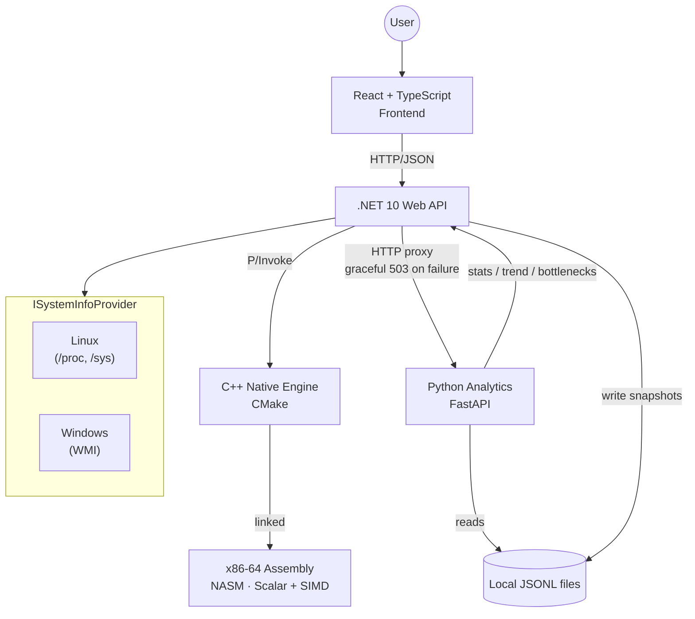

<div align="center">

# 🖥️ System Info

### A Multi-Language System Performance Monitor

**A from-scratch system profiler built by reading raw kernel interfaces directly — no wrapper libraries, no shell commands, just pure low-level engineering.**


**[🎯 What is this?](#-what-is-this) · [💡 Why build this?](#-why-build-this) · [✨ Features](#-features) · [🏗️ Architecture](#%EF%B8%8F-architecture) · [🧰 Tech Stack](#-tech-stack) · [🚀 Getting Started](#-getting-started) · [📂 Project Structure](#-project-structure) · [📍 Project Status](#-project-status)**

</div>

---

## 🎯 What is this?

A full-stack system monitor where **every layer does real, non-trivial work** — CPU, memory, disk, network, and process data read directly from Linux `/proc` and `/sys`, a native C++ engine for hardware sensors, hand-optimized x86-64 Assembly for CPU benchmarking, a Python analytics engine for trend and bottleneck detection, and persistent historical storage in local JSON Lines files — no database, no cloud account, no internet connection required.

```
React (TS) ──► .NET 10 (C#) ──► C++ (CMake) ──► x86-64 Assembly (NASM)
                    │
                    ├──► Local JSONL snapshots (data/snapshots/*.jsonl)
                    │
                    └──► Python (FastAPI) ──► reads local JSONL directly
```

> **This is not a wrapper.** Most system monitors shell out to existing CLI tools or import high-level metrics libraries. This project deliberately avoids that: every data point is sourced directly from kernel interfaces, first-principles native code, or hand-written analysis logic.

---

## 💡 Why build this?

| Typical Monitor | System Info |
|---|---|
| Wraps `psutil` or shells out to `top` | Reads `/proc/stat`, `/proc/meminfo`, `/sys/class/hwmon` directly |
| Monolithic / single-language | Six-piece pipeline with real managed-to-native FFI and a service boundary |
| CPU metrics from an opaque API call | Hand-written Assembly benchmark with SIMD optimization proof |
| Single-platform or platform-coupled | Clean `ISystemInfoProvider` decoupling Linux & Windows |
| Live numbers only, no history | Background snapshot logging + trend/bottleneck detection over time |
| Crashes on missing hardware | Graceful degradation with honest status reporting, end to end |

---

## ✨ Features

### 📊 Live System Dashboard
Real-time CPU load %, RAM breakdown, disk throughput, network I/O, and an active process explorer — polled and refreshed every 2 seconds via a single consolidated endpoint.

### 🐧 Cross-Platform Backend Abstraction
A clean `ISystemInfoProvider` interface with independent implementations — Linux via direct `/proc`/`/sys` parsing, Windows via WMI and `PerformanceCounter`.

### ⚙️ Native C++ Engine
Hardware-level reads — CPU model extraction, thermal zone monitoring, GPU vendor resolution — exposed to C# via P/Invoke.

### 🎮 Vendor-Aware GPU Detection
Dynamically traverses `/sys/class/drm`, dispatching vendor-specific logic (NVIDIA, AMD, Intel) while failing gracefully on unsupported devices.

### 🧮 Hand-Crafted x86-64 Assembly
A real CPU benchmark loop written directly in NASM, with a companion SIMD (SSE2) implementation measuring real scalar-vs-vector speedup (3.94–3.95×).

### 📈 Python Analytics Service
A background service logs CPU/network snapshots to local, append-only JSON Lines files on disk. A FastAPI service reads only the date-range it needs from those files and computes rolling stats, linear trend detection (climbing/dropping/flat), and bottleneck detection — sustained high-load episodes and isolated spikes, classified as CPU-bound or combined CPU+network load.

### 🗄️ Persistent Historical Storage
Every snapshot is appended to a local `data/snapshots/{yyyy}/{MM}/{dd}.jsonl` file (one file per day), read directly by the analytics service — no database, no account, no network dependency. Only the days a request actually needs are opened, so history can grow for months without slowing anything down.

### 🔋 Battery Health
Real charge/discharge status, capacity-fade (design capacity vs current full-charge capacity), and cycle count read directly from `/sys/class/power_supply/BAT*`, dynamically discovered (not hardcoded to `BAT0`) the same way GPU vendor detection scans `/sys/class/drm`. Live on the Overview dashboard as charge and health cards, plus a dedicated Battery tab with full capacity/voltage/device detail. Same honest "unavailable" fallback as every other sensor on a desktop with no battery. On Windows, real cycle count, designed/full-charge capacity, and health now come from the battery class driver via `IOCTL_BATTERY_QUERY_INFORMATION`/`IOCTL_BATTERY_QUERY_STATUS`, not just `GetSystemPowerStatus`. Drain-trend analysis exists in `trend_analysis.py`, reusing the Phase 7 rolling-mean/slope functions.

### 🛡️ Graceful Degradation Throughout
Missing sensors, an unreachable analytics service, or a dropped database connection all report `"unavailable"`/`"degraded"` honestly rather than faking data or crashing.

---

## 🏗️ Architecture



---

## 🧰 Tech Stack

| Layer | Technology | Responsibility |
|:---|:---|:---|
| **Frontend** | React 18, TypeScript, Vite | Responsive UI, state polling, metrics visualization |
| **Backend** | C#, .NET 10 Web API | REST endpoints, system orchestration, platform dispatch |
| **Native Engine** | C++20, CMake | Kernel file descriptor reads, hardware identification |
| **Performance** | x86-64 Assembly (NASM) | Scalar & SIMD instruction benchmarking |
| **Analytics** | Python, FastAPI | Bottleneck detection, trend analysis, HTTP analytics service |
| **Storage** | Local JSON Lines files | Historical snapshot persistence, read directly by the analytics service — no database |

---

## 🚀 Getting Started

### Prerequisites

- **.NET SDK:** 10.0+
- **Node.js:** 20.x or higher
- **Python:** 3.10+ (for the analytics service)
- **Build Tools:** CMake 3.20+, NASM 2.15+
- **Compiler:** GCC/G++ 12+ (Linux) or MSVC / Visual Studio 2022+ (Windows)

### ⚡ Quick Start (recommended)

**First time on a fresh machine** — install everything:

```bash
./setup.sh
```

Checks every prerequisite, installs anything missing, builds the native engine, installs frontend/analytics dependencies, and creates the local data directory — then offers to launch everything immediately. No database account needed. Safe to re-run any time.

**Before every real run** (first time, or after pulling new changes) — validate the whole project builds cleanly, then launch:

```bash
./build.sh
```

An 8-stage, fail-fast pipeline — nothing starts until every stage passes:

1. **Project structure** — confirms `backend/`, `frontend/`, `native/`, `analytics/`, and the key files inside each (`.csproj`, `Program.cs`, `package.json`, `vite.config.ts`, `analytics_service.py`, `native/build.sh`, `setup.sh`, `start-all.sh`) actually exist
2. **Build commands** — checks `dotnet`, `node`, `npm`, `python3`, `cmake`, `gcc`, `g++`, `make` are all on `PATH` (unlike `setup.sh`, it does **not** install anything missing — it just fails immediately with a clear "not installed" error, so run `setup.sh` first on a truly fresh machine)
3. **Environment** — logs installed versions of Node/npm/.NET/Python; checks the local data directory is writable
4. **Native C++ engine** — runs `native/build.sh`, then confirms `libsystemmonitor_native.so` actually landed in `backend/SystemMonitor.Api/`
5. **.NET backend** — `dotnet restore` + `dotnet build --configuration Release`, then greps `Program.cs` to confirm both `MapSystemEndpoints` and `MapSpeedTestEndpoints` are registered
6. **Frontend** — `npm install` if `node_modules` is missing, then a real production build (`npm run build`), confirms `frontend/dist` was generated, and checks a set of speed-test frontend files exist (`types/speedtest.ts`, `hooks/useSpeedTest.ts`, `components/SpeedTestCard.tsx`)
7. **Python analytics** — `py_compile`s `analytics_service.py`, confirms `fastapi`/`uvicorn` are importable (prints installed versions), and confirms the FastAPI `app` object itself imports without error
8. **Final validation** — makes `setup.sh`/`start-all.sh` executable if they aren't, then runs `bash -n` syntax checks on `setup.sh`, `start-all.sh`, and `build.sh` itself

Every step's full output goes to `logs/build.log` (overwritten each run) as well as the console, so a failure points you straight at the real error instead of a vague "something broke." **If every stage passes, `build.sh` automatically execs `./start-all.sh` for you** — one command from a clean clone (or a fresh pull) all the way to a running app.

**Already built and just want to start the three services?**

```bash
./start-all.sh
```

Starts the backend, analytics service, and frontend together — waits for each to actually be ready before starting the next, and fails loudly with the real error log if something doesn't come up correctly. One command, no juggling terminals.

### 🔧 Manual Setup

If you'd rather run each piece yourself, or `setup.sh` doesn't fit your environment:

**1. Build the Native Engine & Assembly Layer**

```bash
cd native
mkdir -p build && cd build
cmake ..
make
cp libsystemmonitor_native.so ../../backend/SystemMonitor.Api/
```

**2. Set the database connection string**

```bash
# No database setup needed — historical data is stored locally.
# Optional override for where local history is stored (defaults to
# %LOCALAPPDATA%\SystemInfo\data on Windows, ~/.local/share/SystemInfo/data on Linux):
export SYSTEM_INFO_DATA_DIR="$HOME/.local/share/SystemInfo/data"
```

Required by both the backend (`SnapshotLogger.cs`) and the analytics service — set it once in your shell profile (`~/.bashrc`) so every terminal has it.

**3. Start the .NET Backend API**

```bash
cd backend/SystemMonitor.Api
dotnet run
```

API listens on `http://localhost:XXXX`.

**4. Launch the Frontend**

```bash
cd frontend
npm install
npm run dev
```

Dashboard available at `http://localhost:5173`.

**5. Start the Analytics Service**

```bash
pip install fastapi uvicorn
cd analytics
uvicorn analytics_service:app --reload --port 8001
```

Enables `/api/analytics/stats`, `/api/analytics/trend`, and `/api/analytics/bottlenecks` on the backend. The dashboard and core system endpoints work fine without this running — analytics endpoints degrade gracefully to a 503 if it's not up.

### 🖥️ Windows Desktop App (Tauri)

On Windows, the preferred way to run and build System Info is now as a real native desktop app via [Tauri 2](https://v2.tauri.app/) — no browser tab, no juggling three terminals, no leftover processes in Task Manager when you close it.

**Extra prerequisites** beyond the ones above: a Rust toolchain ([rustup.rs](https://rustup.rs)) and the Microsoft C++ Build Tools (Visual Studio 2022's "Desktop development with C++" workload covers both).

```powershell
cd frontend
npm install
npm run tauri dev
```

This opens the actual application window and, from `frontend/src-tauri/src/process.rs`, automatically starts the backend and analytics service against your local `dotnet build`/PyInstaller output (falls back to whatever's under `backend/SystemMonitor.Api/bin` and `analytics/dist` — build those first if you haven't). The plain `npm run dev` / Vite-only workflow above still works too, for frontend-only iteration in a browser tab.

Production build (native window, bundled backend/analytics, NSIS installer):

```powershell
npm run tauri build
```

Expects the backend and analytics executables already staged under `frontend/src-tauri/resources/backend/` and `frontend/src-tauri/resources/analytics/` (the release CI workflow does this automatically — see `.github/workflows/release.yml`'s "Stage backend and analytics as Tauri resources" step for the exact commands if you're doing it by hand). Output lands in `frontend/src-tauri/target/release/bundle/nsis/`.

Frontend-only build (`npm run build`, producing just `frontend/dist/`) continues to work unchanged, independent of Tauri.

---

## 📂 Project Structure

```
system-info/
├── frontend/                     # React + TypeScript Web App
│   ├── src/
│   │   ├── components/           # Real-time UI widgets & charts
│   │   ├── hooks/                # Metric polling & lifecycle hooks
│   │   ├── lib/                  # apiConfig/version/tauri — shared frontend config
│   │   └── types/                # System metric TypeScript interfaces
│   │
│   └── src-tauri/                # Tauri 2 native desktop shell (Windows)
│       ├── src/
│       │   ├── process.rs        # Starts/health-checks/stops backend & analytics
│       │   ├── commands.rs       # start_services/stop_services/exit_app commands
│       │   └── lib.rs            # Window setup, startup sequence, close cleanup
│       ├── capabilities/         # Tauri 2 permission grants (no shell access)
│       ├── resources/            # Backend/analytics build output, staged by CI
│       └── tauri.conf.json
│
├── backend/                      # .NET 10 API Solution
│   └── SystemMonitor.Api/
│       ├── Endpoints/             # System, native & analytics HTTP endpoints
│       ├── interface/             # ISystemInfoProvider contract & DTOs
│       ├── Native/                # P/Invoke bridge bindings
│       └── services/              # Providers, background sampler, snapshot logger
│
├── native/                       # Low-level Native Engine
│   ├── include/                  # C++ header declarations
│   ├── src/                      # Hardware & thermal sensor implementations
│   └── CMakeLists.txt
│
├── assembly/                     # x86-64 Assembly workloads (NASM)
│
├── analytics/                    # Python analytics: stats, trend, bottleneck
│   │                              detection, and the FastAPI service exposing them
│
├── scripts/                      # sync-version.mjs / check-version.mjs — the one
│   │                              place the app's version is set and validated
│
├── launcher/                      # DEPRECATED — pre-Tauri browser-launching
│   │                               production launcher, kept as a rollback
│   │                               reference (see file header)
│
├── Directory.Build.props         # Single .NET version source (backend + launcher)
├── setup.sh                      # First-time prerequisite install + local data dir setup
├── build.sh                      # Fail-fast full build/validation, then launches start-all.sh
├── start-all.sh                  # Starts backend + analytics + frontend together
├── SystemInfo.iss                # DEPRECATED — pre-Tauri Inno Setup installer script
│
└── PROJECT_STATUS.md             # Full engineering build log
```

---

## 📍 Project Status

| # | Phase | Layer | Status |
|:-:|---|---|:-:|
| 1 | Environment Setup | Tooling | ✅ Done |
| 2 | Basic Application | React + .NET | ✅ Done |
| 3 | System Monitoring | C# / Linux kernel | ✅ Done |
| 4 | Native C++ Engine | C++ / P/Invoke | ✅ Done |
| 5 | Hardware Monitoring | C++ / sysfs | ✅ Done |
| 6 | Assembly | NASM x86-64 | ✅ Done |
| — | Cross-Platform Refactor | C# + C++ | ✅ Done |
| — | Optimization Pass | C# | ✅ Done |
| 7 | Python Analytics (trend + bottleneck detection) | Python / FastAPI | ✅ Done |
| 8 | Historical Storage | Local JSON Lines files | ✅ Done |
| 9 | Battery Health (charge/discharge, health %, cycle count) | C++ / sysfs / React | ✅ Done |
| 10 | Advanced Dashboard UI | React | 🔶 In Progress — layout & UI being remade |
| 11 | Maintenance & Extensibility | Cross-cutting | ⬜ Planned |

> Full phase-by-phase engineering log, verification steps, bugs found & fixed, and performance metrics live in [`PROJECT_STATUS.md`](./PROJECT_STATUS.md).

---

## 🧠 Philosophy

```
Build it from scratch.
Understand every boundary.
Do not hide underlying systems behind convenience libraries
when mastering the machine is the entire point.
```

---

<div align="center">

Released under the [MIT License](LICENSE)
Crafted with curiosity, raw memory buffers, and assembly instructions.

</div>
