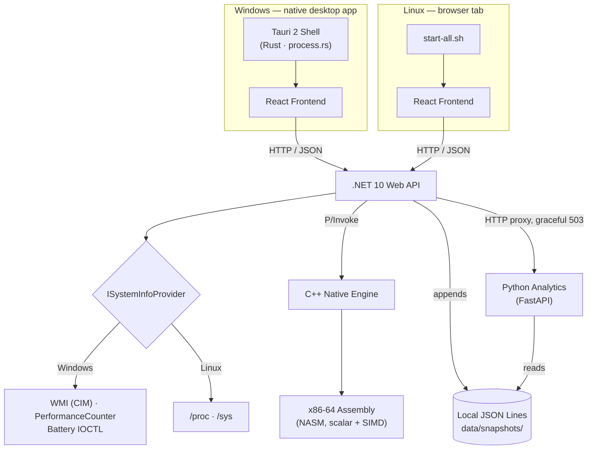

<div align="center">

# 🖥️ System Info

**A cross-platform system-monitoring desktop application — live hardware telemetry, historical trend analysis, and a native Windows desktop shell, built across six languages with no database and no cloud dependency.**

`React 19` · `TypeScript` · `.NET 10` · `Tauri 2 / Rust` · `C++17` · `x86-64 Assembly` · `Python / FastAPI`

[Features](#-features) · [Architecture](#-architecture) · [Tech Stack](#-tech-stack--why) · [API](#-api-reference) · [Getting Started](#-getting-started) · [Building](#-building--packaging) · [Project Status](./PROJECT_STATUS.md)

</div>

---

## 📖 Overview

System Info is a real-time system-monitoring dashboard, distributed as a native desktop application. It reads live hardware and OS telemetry directly from the operating system (CPU, RAM, disk, network, processes, battery, GPU, and system identity), stores a rolling history of that telemetry locally, and serves both the live view and historical trend/bottleneck analysis through a single desktop app.

There is no backend cloud service, no account, and no external database. Everything the app needs — live readings and historical snapshots — is produced and stored on the machine it runs on.

**Platform support today:**

| Platform | Distribution | Shell |
|---|---|---|
| **Windows** | NSIS installer (`SystemInfo-Setup.exe`) | Native desktop window via **Tauri 2** |
| **Linux** | AppImage or `.deb` | Browser tab, launched by `start-all.sh` |

---

## ✨ Features

- **Live dashboard** — CPU, RAM, disk, network, and process metrics, polled and cached server-side, with a `Live · updated Ns ago` freshness indicator that degrades through `Reconnecting` → `Offline` so a stale reading is never mistaken for a current one.
- **System identity** — computer name, manufacturer, model, BIOS version, Windows edition/build, architecture, and uptime — read from `Win32_ComputerSystem`/`Win32_BIOS`/`Win32_OperatingSystem` on Windows, DMI sysfs + `/etc/os-release` on Linux.
- **GPU detection** — every display adapter detected (multi-GPU laptops included), with driver info, resolution/refresh rate, and live per-engine utilization (3D, Copy, VideoDecode, …) rather than one fabricated "GPU usage" number.
- **Real battery telemetry on Windows** — charge, charging state, voltage, remaining/full capacity, and cycle count read via the battery class driver's IOCTL interface (`IOCTL_BATTERY_QUERY_TAG`/`_INFORMATION`/`_STATUS`) — the same interface `powercfg /batteryreport` uses.
- **Historical analytics** — CPU/network trend charts, bottleneck-episode detection, and summary stats over selectable windows (1h / 6h / 24h / 7d), served by a Python/FastAPI microservice reading the local snapshot files.
- **Network speed test** — client-side download/upload/ping test against Cloudflare's public speed-test endpoints.
- **Local, file-based storage** — append-only JSON Lines snapshots, no database to install, configure, or lose connectivity to.
- **Native Windows desktop app** — a real window (not a browser tab) that owns the backend/analytics process lifecycle, with Start / Stop / Exit controls and orphan-process hardening via Windows Job Objects.
- **No hardware values are ever fabricated.** Anything the OS doesn't expose is reported as `Unavailable`, never guessed, defaulted to `0`, or silently omitted — enforced consistently across every metric, on both platforms.

---

## 🏗️ Architecture



**Request flow, live metrics:** the frontend polls `GET /api/system/all` once per cycle → the API's `SystemMonitorBackgroundService` returns already-cached CPU/network samples and calls `ISystemInfoProvider` for RAM/disk/battery on demand → the platform-specific provider (Windows: WMI + `PerformanceCounter`; Linux: `/proc`, `/sys`) does the actual read.

**Request flow, history:** the same background service appends every sample to a local JSON Lines file → the frontend's Analytics tab calls the .NET API → the API proxies to the Python analytics service (with a graceful `503` if it isn't running) → the Python service reads and aggregates the `.jsonl` files directly.

**Two separate hardware-reading paths exist by design:** most live metrics (`/api/system/*`) go through `ISystemInfoProvider` in C#, talking to the OS directly (WMI/PerformanceCounter on Windows, `/proc`/`/sys` on Linux). A second, independent native C++/Assembly engine (`/api/native/*`) exists for CPU benchmarking (scalar + SIMD), GPU vendor/AMD-usage detection, and diagnostic hardware reads. The dashboard's dedicated GPU panel and CPU/RAM/battery cards currently read through the C# provider path, not the native engine.

---

## 🧰 Tech Stack & Why

| Layer | Technology | Responsibility | Why this choice |
|---|---|---|---|
| **Frontend** | React 19, TypeScript, Vite 8 | Dashboard UI, metric polling, visualization | Fast dev loop (Vite), type-safe data contracts across seven views |
| **Styling** | Tailwind CSS 4 | Utility-first styling, shared design tokens | One spacing/type/color scale reused across every panel (`Primitives.tsx`) instead of per-component CSS |
| **Desktop Shell (Windows)** | Tauri 2, Rust, `win32job` | Native window, backend/analytics process lifecycle, orphan-process prevention | Real OS window instead of a browser tab; Rust gives safe, low-overhead process management with no Electron-sized runtime |
| **Backend** | C#, .NET 10 Web API (Minimal APIs) | REST endpoints, platform-provider dispatch, snapshot writes, analytics proxy | Strong typing and WMI/`PerformanceCounter` access on Windows without native interop for most metrics |
| **Native Engine** | C++17, CMake | Kernel/OS-level hardware reads exposed via P/Invoke; CPU benchmarking | Direct OS-level access (DXGI, sysfs) where a managed API isn't sufficient or fast enough |
| **Performance Demo** | x86-64 Assembly (NASM) | Scalar & SIMD (SSE2) CPU benchmarking, called from the C++ engine | Ground-truth performance baseline the C++/C# layers are measured against |
| **Analytics** | Python 3.10+, FastAPI, uvicorn | Trend analysis, bottleneck detection, stats aggregation over historical snapshots | Fast to iterate on for numeric/statistical work; runs as an independent, restartable process |
| **Storage** | Local JSON Lines files | Historical snapshot persistence | No database to install, configure, or fail to connect to — see [Storage](#-storage--historical-data) below for the MongoDB → local-file migration |
| **Build / Release** | GitHub Actions (`release.yml`), Tauri's NSIS bundler, `appimagetool`, `dpkg-deb` | CI builds for both platforms, version-tag-driven GitHub Releases | Single workflow, four jobs (`version` → `build-windows` / `build-linux` → `release`), triggered by pushing a new `CHANGELOG.md` entry |

---

## 📁 Project Layout

```text
System Info/
├── frontend/                      # React 19 + TypeScript + Vite dashboard
│   ├── src/
│   │   ├── components/
│   │   │   ├── views/              # OverviewView, AnalyticsView, ProcessesView,
│   │   │   │                       # StorageView, NetworkView, BatteryView, SystemView
│   │   │   ├── common/              # Shared design-system primitives (Panel, InfoRow,
│   │   │   │                       # StatTile, Sparkline, UsageBar, States, Table, ...)
│   │   │   └── layout/              # AppShell, Sidebar, TopBar, ServiceControls
│   │   ├── hooks/                   # useSystemMetrics, useSystemInfo, useSystemGpu,
│   │   │                            # useAnalytics, useSpeedTest, useServiceControl, ...
│   │   └── lib/                     # apiConfig.ts (env-aware API base), tauri.ts, format.ts
│   └── src-tauri/                   # Tauri 2 desktop shell (Rust)
│       └── src/                     # main.rs, lib.rs, process.rs, commands.rs
│
├── backend/SystemMonitor.Api/       # .NET 10 Minimal API
│   ├── Endpoints/                   # SystemEndpoints, AnalyticsEndpoints,
│   │                                 # NativeEndpoints, SpeedTestEndpoints
│   ├── services/                    # WindowsSystemInfoProvider, LinuxSystemInfoProvider,
│   │                                 # SystemMonitorBackgroundService, LocalJsonSnapshotStore,
│   │                                 # WindowsBatteryInterop, AppDataPath, SnapshotLogger
│   ├── interface/                   # ISystemInfoProvider, ISnapshotStore
│   └── Native/                      # NativeInterop.cs — P/Invoke bridge to the C++ engine
│
├── native/                          # C++17 native engine (CMake)
│   ├── include/native_engine.h      # Cross-platform C ABI (extern "C")
│   └── src/                         # common.cpp, windows_provider.cpp, linux_provider.cpp
│
├── assembly/                        # x86-64 NASM — scalar + SIMD (SSE2) CPU benchmarks
│
├── analytics/                       # Python 3.10+ / FastAPI analytics microservice
│   ├── analytics_service.py         # /health, /stats, /trend, /bottlenecks
│   ├── trend_analysis.py, bottleneck_detection.py, analyze_snapshots.py
│   └── run_analytics.py             # PyInstaller entrypoint for analytics.exe
│
├── launcher/                        # DEPRECATED — pre-Tauri browser-launching production
│                                     # launcher, kept as a rollback reference only
│
├── packaging/linux/                 # AppImage/.deb desktop file, icon, AppRun
├── scripts/                         # sync-version.mjs, check-version.mjs,
│                                     # archive-changelog.mjs (see below)
├── .github/workflows/release.yml    # The single CI/CD pipeline (version → build → release)
│
├── setup.sh / setup.ps1             # First-time prerequisite install + local data dir setup
├── start-all.sh / start-all.ps1     # DEV-ONLY: start backend + analytics + frontend together
├── build.sh                         # Fail-fast full build/validation
├── clean.sh                         # Strip build artifacts before archiving/sharing the repo
├── SystemInfo.iss                   # DEPRECATED — pre-Tauri Inno Setup installer script
│
├── CHANGELOG.md                     # Recent version history (source of truth for the app
│                                     # version — see Version Management below)
├── CHANGELOG_ARCHIVE.md             # Everything older, split out to keep CHANGELOG.md short
└── PROJECT_STATUS.md                # Detailed engineering status & history (this file's sibling)
```

`database/`, `docs/`, and `tests/` currently exist as **empty placeholder directories** in the repository — no automated test suite or additional documentation lives there yet (see [Known Limitations](./PROJECT_STATUS.md#known-limitations) in `PROJECT_STATUS.md`).

---

## 📊 Metrics Tracked

| Metric | Windows source | Linux source | Notes |
|---|---|---|---|
| CPU (usage, model, cores) | `PerformanceCounter` (`% Processor Time`), `Win32_Processor`-equivalent native read | `/proc/stat`, `/proc/cpuinfo` | Cached server-side; polled continuously by `SystemMonitorBackgroundService` |
| RAM | `Win32_OperatingSystem` (`TotalVisibleMemorySize`/`FreePhysicalMemory`) | `/proc/meminfo` | |
| Disk | `DriveInfo` (.NET) | `DriveInfo` (.NET) | Capacity/usage only — full SMART health is not implemented (needs root) |
| Network | Windows network counters | `/proc/net/dev` | Throughput, not "internet speed" |
| Processes | .NET `Process` APIs | `/proc/[pid]/status` | Parallelized listing |
| **Battery** | Battery class driver IOCTL (`IOCTL_BATTERY_QUERY_*`) | sysfs `BAT*` (dynamic discovery, unit auto-detection) | Cycle count/health are hardware-dependent; reported `Unavailable` when the driver doesn't expose them, never `0` |
| **GPU** | `Win32_VideoController` (static) + `GPU Engine` performance-counter category (live, per-engine) | Native engine: `get_gpu_vendor()` / `get_amd_gpu_usage_percent()` (sysfs) | Windows returns every detected adapter as a list; multi-GPU laptops (integrated + discrete) are both reported |
| **System Identity** | `Win32_ComputerSystem`, `Win32_BIOS`, `Win32_OperatingSystem` | DMI sysfs (`/sys/class/dmi/id/*`), `/etc/os-release`, `/proc/uptime` | Manufacturer, model, BIOS version, Windows edition/build, uptime |
| CPU temperature | Native engine (Windows path) | Native engine, sysfs thermal zones | `Unavailable` where no trustworthy sensor exists — never guessed |
| Fan RPM | Native engine | Native engine | Correctly reports `Unavailable` on hardware with no exposed sensor |

**Design principle, applied everywhere above:** *if the OS can prove it, display it — if it can't, display "Unavailable." Never fill the gap with a guess.*

---

## 🔌 API Reference

All endpoints are served by the .NET backend on `:5132` (or the port the frontend's `apiConfig.ts` resolves per environment).

| Method | Route | Purpose |
|---|---|---|
| `GET` | `/health` | Dependency-free readiness probe (used by the Tauri process manager) |
| `GET` | `/api/system/all` | Consolidated live snapshot: CPU + RAM + disk + network + battery in one call |
| `GET` | `/api/system/cpu` | Cached CPU usage |
| `GET` | `/api/system/ram` | RAM usage |
| `GET` | `/api/system/disk` | Disk capacity/usage |
| `GET` | `/api/system/network` | Cached network throughput |
| `GET` | `/api/system/processes` | Running process list |
| `GET` | `/api/system/battery` | Battery status |
| `GET` | `/api/system/info` | Static system identity (fetched once, not polled) |
| `GET` | `/api/system/gpu` | GPU adapter list + live per-engine utilization |
| `GET` | `/api/analytics/stats?minutes=` | Summary statistics over a time window |
| `GET` | `/api/analytics/trend?minutes=&window=` | CPU/network trend series |
| `GET` | `/api/analytics/bottlenecks?minutes=` | Detected bottleneck episodes |
| `GET` | `/api/speed-test` | Server-side download/upload/ping test against Cloudflare *(implemented, but the dashboard currently runs this client-side instead — see below)* |
| `GET` | `/api/native/cpuinfo`, `/cpu`, `/cputemp`, `/gpu`, `/battery`, `/fan` | Diagnostic reads through the native C++ engine |
| `GET` | `/api/native/test`, `/benchmark`, `/asmtest`, `/simd-benchmark` | Native engine self-tests and the scalar/SIMD CPU benchmark |

**Speed test note:** the dashboard's `NetworkView` measures download/upload/ping directly from the browser against `speed.cloudflare.com`, so results aren't affected by a loopback hop through the local backend. `SpeedTestEndpoints.cs` implements the same measurement server-side but isn't currently called by the frontend.

CORS is restricted to `http://localhost:5173` (Vite dev), `http://tauri.localhost` (Tauri 2 WebView2), and `tauri://localhost` (non-Windows Tauri targets).

---

## 🪟 Desktop Application (Tauri 2)

On Windows, `frontend/src-tauri/` wraps the React frontend in a real, resizable desktop window (1280×820 default, 980×650 minimum) instead of opening a browser tab.

- **`process.rs`** — spawns the backend (`:5132`) and analytics service (`:8001`) as managed child processes, polling each one's `/health` endpoint (400ms interval, 30s timeout) before the app reports itself ready.
- **`commands.rs`** — the *only* surface the frontend has onto process control: `start_services`, `stop_services`, `get_service_status`, `exit_app`. There is no generic "run this command" entry point, and the app deliberately does not use `tauri-plugin-shell` — the frontend has no shell/command-execution capability at all.
- **Orphan-process hardening** — each child process is assigned to its own Windows Job Object (`win32job` crate, `KILL_ON_JOB_CLOSE`), so an interpreter process extracted by a PyInstaller `--onefile` bootstrap (which plain `Child::kill()` can miss) is guaranteed to die with it, including on an unexpected crash of the app itself.
- **Service controls** — `ServiceControls.tsx` (rendered only inside the Tauri shell) exposes **Stop** (halts services, keeps the window open), **Exit** (stops services and closes the app), and the native window's `X` button performs the same full shutdown as Exit.

Linux does not yet use Tauri — `start-all.sh` starts the three services directly and the app runs from a browser tab (see [Platform-Specific Behavior](#-platform-specific-behavior--limitations)).

---

## 📈 Storage & Historical Data

**Before:** snapshot history was written to and read from **MongoDB Atlas** — `SnapshotLogger.cs` wrote documents, `analytics_service.py` queried Mongo directly, and a `MONGO_URI` connection string had to be configured before analytics would work at all.

**Why it changed:** MongoDB Atlas added an external dependency, an account, and a network requirement to what is otherwise a fully local, offline-capable application — and mid-project the target was originally PostgreSQL before the team settled on Mongo Atlas as what was available at the time.

**Now:** `ISnapshotStore` / `LocalJsonSnapshotStore` write append-only JSON Lines files at `data/snapshots/{yyyy}/{MM}/{dd}.jsonl`. `AppDataPath.cs` resolves the writable location automatically:

| Environment | Location |
|---|---|
| Development (`Development` env) | `./data` |
| Windows (packaged) | `%LOCALAPPDATA%\SystemInfo\data` |
| Linux (packaged) | `~/.local/share/SystemInfo/data` |

`analytics_service.py` reads these `.jsonl` files directly for the requested date range; malformed lines are logged and skipped rather than crashing the request. There is currently **no retention/TTL policy** — the snapshot directory grows unbounded over time (a known, documented trade-off, not a bug).

---

## 🚀 Getting Started

### Prerequisites

- **.NET SDK:** 10.0+
- **Node.js:** 20.x+
- **Python:** 3.10+
- **Build tools:** CMake 3.10+, NASM
- **Windows only, for the desktop shell:** Rust (stable), the Tauri 2 CLI

### First-time setup

```bash
# Linux — checks/installs prerequisites, builds the native engine,
# installs frontend/analytics dependencies, creates the local data dir
./setup.sh
```
```powershell
# Windows — developer setup only; not required to run the packaged app
powershell -ExecutionPolicy Bypass -File setup.ps1
```

### Running in development

```bash
# Linux/dev: starts backend + analytics + frontend together, waiting for
# each to actually respond before starting the next
./start-all.sh
```
```powershell
# Windows dev-only equivalent (dotnet run / npm run dev / uvicorn directly)
powershell -ExecutionPolicy Bypass -File start-all.ps1
```

Or run each service individually:

```bash
cd backend/SystemMonitor.Api && dotnet run
cd analytics && python -m uvicorn analytics_service:app --port 8001
cd frontend && npm install && npm run dev
```

To run the Windows desktop shell in dev mode:

```bash
cd frontend && npm run tauri dev
```

### Full validation build

```bash
./build.sh   # native engine → backend → frontend, fail-fast at the first broken step
```

---

## 📦 Building & Packaging

**Before:** the Windows build was a whole-repository Inno Setup installer (`SystemInfo.iss`) that required the end user to have Node, npm, Python, pip, and the .NET SDK installed — later replaced by a self-contained `dotnet publish` plus a C# console launcher (`launcher/Program.cs`) that started the services and opened a browser tab.

**Now:** CI (`.github/workflows/release.yml`) builds and packages both platforms in one workflow, triggered by a push containing a new top `CHANGELOG.md` entry:

1. **`version`** — parses `CHANGELOG.md`'s top `## [x.y.z]` entry, checks whether that tag already exists.
2. **`build-windows`** — builds the native C++ engine, publishes the .NET backend self-contained, embeds the built frontend into its `wwwroot`, freezes the analytics service with PyInstaller, stages both as Tauri resources, and runs `tauri build` to produce the NSIS installer.
3. **`build-linux`** — builds the same native/backend/frontend/analytics stack, then packages an AppImage and a `.deb`.
4. **`release`** — downloads all three build artifacts, extracts that version's section out of `CHANGELOG.md` for the release notes, and publishes a GitHub Release with the version tag.

`launcher/Program.cs`, `SystemInfo.iss`, `setup.ps1`, and `start-all.ps1` remain in the repository — clearly marked deprecated/dev-only in their own file headers — as a rollback reference, not as part of the current build. `README-WINDOWS-INSTALLER.md` and `GITHUB-ACTIONS-SETUP.md` document that older Inno-Setup-based path and predate the current Tauri pipeline.

---

## 🔢 Version Management

Five version-bearing files are kept in lockstep from a single source — `CHANGELOG.md`'s top entry:

```
frontend/package.json · frontend/src-tauri/tauri.conf.json · frontend/src-tauri/Cargo.toml
Directory.Build.props (.NET) · SystemInfo.iss
```

```bash
node scripts/sync-version.mjs      # propagates CHANGELOG.md's top version to all five files
node scripts/check-version.mjs     # fails loudly if any of them drift — this is what CI runs
```

## 📝 Changelog Management

`CHANGELOG.md` holds `[Unreleased]` plus the most recent releases; everything older lives in `CHANGELOG_ARCHIVE.md`, split out verbatim (nothing summarized or deleted) so the main file stays short and readable.

```bash
node scripts/archive-changelog.mjs           # move everything but the 2 newest releases into the archive
node scripts/archive-changelog.mjs --keep 3  # keep more/fewer recent releases in CHANGELOG.md
```

This is a manual step you run after cutting a release — it isn't wired into CI. `scripts/check-version.mjs` and `release.yml`'s version detection only ever read `CHANGELOG.md`'s *top* entry, which archiving never removes, so it never affects a release build.

---

## 🛠️ Development Scripts

| Script | Purpose |
|---|---|
| `setup.sh` / `setup.ps1` | First-time prerequisite install + local data directory setup (Linux full / Windows dev-only) |
| `start-all.sh` / `start-all.ps1` | Start backend + analytics + frontend together, waiting for readiness at each step (Linux full / Windows dev-only) |
| `build.sh` | Fail-fast full build/validation across every layer |
| `clean.sh` | Strip generated build artifacts (`node_modules`, `dist`, `bin`/`obj`, caches) before archiving or sharing the repo — never removes source, `.git`, or config |
| `scripts/sync-version.mjs` | Propagate `CHANGELOG.md`'s top version to all five version-bearing files |
| `scripts/check-version.mjs` | Verify all five version-bearing files agree (run by CI) |
| `scripts/archive-changelog.mjs` | Move old `CHANGELOG.md` entries into `CHANGELOG_ARCHIVE.md` |

---

## 🌍 Platform-Specific Behavior & Limitations

- **Windows** ships as a native Tauri desktop app; **Linux** ships as an AppImage/`.deb` still using the pre-Tauri browser-tab model — Linux has not yet been migrated to Tauri.
- **GPU:** Windows reports every detected adapter via `Win32_VideoController` with live per-engine utilization; Linux's GPU path goes through the native engine's `get_gpu_vendor()`/`get_amd_gpu_usage_percent()` (AMD sysfs), a narrower path than the Windows one.
- **Battery:** implemented on both platforms; the Windows IOCTL path and DXGI-linked GPU code have **not been hardware-verified** — no Windows/`dotnet` toolchain was available in the environment that most recently wrote/extended them. Windows native cross-compilation (via `mingw-w64`) was verified in isolation, but not the same as a Windows-hosted build.
- **Storage health:** disk capacity/usage only — full SMART health needs root and is not implemented on either platform.
- **Testing:** no automated test suite exists yet; the `tests/` directory is currently an empty placeholder.

See [`PROJECT_STATUS.md`](./PROJECT_STATUS.md) for the full, itemized list of what has and hasn't been hardware-verified.

---

## 📄 License

No `LICENSE` file is currently present in this repository.

---

<div align="center">

For detailed engineering history, verification status, and remaining work, see **[`PROJECT_STATUS.md`](./PROJECT_STATUS.md)**.

</div>
