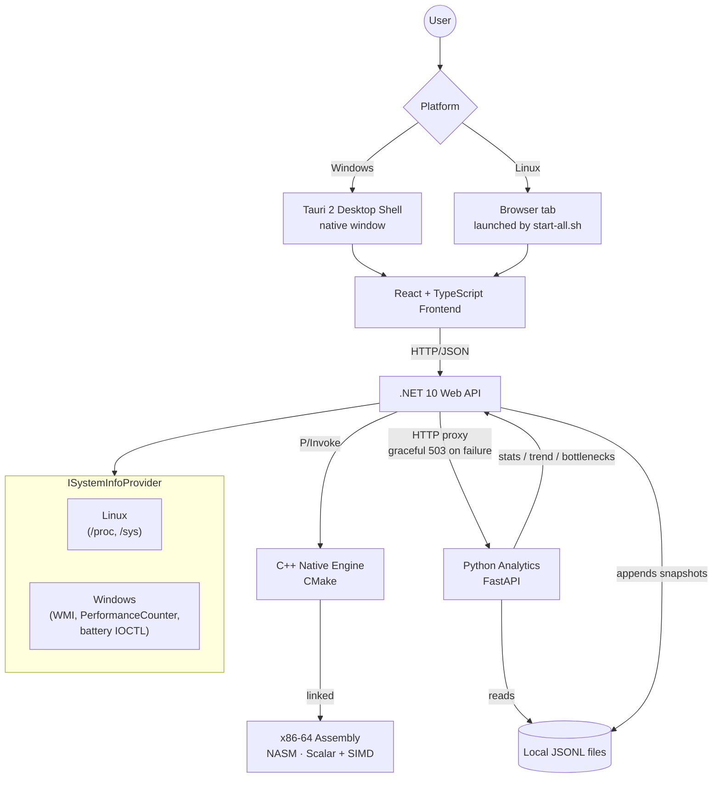

<div align="center">

# 🖥️ System Info

### A Multi-Language System Performance Monitor

**A from-scratch system profiler built by reading raw kernel/OS interfaces directly — no wrapper libraries, no shelled-out CLI tools, just first-principles engineering across six languages.**


**[🎯 What is this?](#-what-is-this) · [✨ Features](#-features) · [🏗️ Architecture](#%EF%B8%8F-architecture) · [🧰 Tech Stack](#-tech-stack) · [🚀 Getting Started](#-getting-started) · [📂 Project Structure](#-project-structure) · [📜 Project Evolution](#-project-evolution) · [⚠️ Known Limitations](#%EF%B8%8F-known-limitations) · [📍 Project Status](#-project-status)**

</div>

---

## 🎯 What is this?

A full-stack system monitor where **every layer does real, non-trivial work**: CPU, memory, disk, network, process, and battery data read directly from OS kernel interfaces, a native C++ engine for hardware sensors, hand-optimized x86-64 Assembly for CPU benchmarking, a Python analytics engine for trend and bottleneck detection, and persistent historical storage in local JSON Lines files — no database, no cloud account, no internet connection required.

```
React (TS) ──► .NET 10 (C#) ──► C++ (CMake) ──► x86-64 Assembly (NASM)
                    │
                    ├──► Local JSONL snapshots (data/snapshots/*.jsonl)
                    │
                    └──► Python (FastAPI) ──► reads local JSONL directly
```

The application runs **cross-platform** — Linux (`/proc`, `/sys`) and Windows (WMI, `PerformanceCounter`, the battery class driver) — behind one `ISystemInfoProvider` abstraction, with a packaged desktop experience on each:

- **Windows** ships as a native desktop app: a [Tauri 2](https://v2.tauri.app/) shell wraps the React frontend in a real window and manages the backend + analytics service as child processes, distributed via an NSIS installer.
- **Linux** ships as an AppImage or `.deb`: `start-all.sh` launches the backend, analytics service, and Vite-built frontend together and opens them in the default browser — the pre-Tauri distribution model, still the current one for this platform (see [Known Limitations](#%EF%B8%8F-known-limitations)).

> **This is not a wrapper.** Most system monitors shell out to existing CLI tools or import high-level metrics libraries. This project deliberately avoids that: every data point is sourced directly from OS interfaces, first-principles native code, or hand-written analysis logic.

---

## ✨ Features

| Feature | Status | Notes |
|---|:-:|---|
| CPU, RAM, disk, network, process monitoring | ✅ | Linux via `/proc`/`/sys`, Windows via WMI/`PerformanceCounter`/native DXGI, behind `ISystemInfoProvider` |
| CPU/network background sampling & caching | ✅ | `SystemMonitorBackgroundService` samples continuously (after a 3s JIT/Kestrel startup delay); endpoints read the cache, frontend polls every 2s |
| Native C++ hardware reads (CPU model, thermal zone, GPU vendor) | ✅ | `native/` (CMake), exposed to C# via P/Invoke |
| GPU vendor detection | ✅ Linux (NVIDIA tested, AMD path written but unverified on real hardware) · ⚠️ Windows (DXGI-linked, not hardware-verified) | Dynamic `/sys/class/drm` scan on Linux; unsupported vendors report `"unavailable"` honestly |
| Fan RPM | ⚠️ Hardware/driver dependent | Reads `"unavailable"` correctly on hardware with no exposed sensor |
| x86-64 Assembly CPU benchmark (scalar + SIMD) | ✅ | NASM via CMake's `ASM_NASM`; SIMD (SSE2) measured at 3.94–3.95× over scalar |
| Battery: charge %, charging state | ✅ Linux · ✅ Windows | Windows via `GetSystemPowerStatus` |
| Battery: capacity, voltage, health %, cycle count | ✅ Linux (verified, `/sys/class/power_supply`) · ⚠️ Windows (implemented via `IOCTL_BATTERY_QUERY_INFORMATION`/`IOCTL_BATTERY_QUERY_STATUS`, **not yet verified on real Windows hardware**) | Falls back to an honest partial-data note on Windows if the driver doesn't answer the detailed query |
| Speed test (download/upload/ping) | ✅ | `GET /api/speed-test` |
| Local historical snapshots | ✅ | Append-only `data/snapshots/{yyyy}/{MM}/{dd}.jsonl`, no database |
| Trend analysis (CPU/network climbing/dropping/flat) | ✅ via API | `analytics_service.py`, proxied through the backend with graceful 503 degradation |
| Bottleneck detection (sustained load vs. spikes, `cpu_bound`/`combined_load`) | ✅ via API | Same analytics service |
| Battery trend / time-to-empty analysis | 🚧 Written, not wired up | `trend_analysis.py` still reads a standalone `--file snapshots.jsonl` CLI argument that hasn't existed since the move off MongoDB — not yet reachable from `analytics_service.py` or the dashboard |
| Dashboard (Overview, Analytics, Processes, Storage, Network, Battery, System) | ✅ | Shared design-system primitives (`Primitives.tsx`); live-freshness indicator (`Live` → `Reconnecting` → `Offline`) |
| Desktop packaging | ✅ Windows (Tauri, NSIS) · ✅ Linux (AppImage, `.deb`) | See [Architecture](#%EF%B8%8F-architecture) |
| Automated tests | ❌ | `tests/` exists but is empty — everything has been verified manually so far |
| Full SMART storage health | 📌 Planned | Needs root; only basic disk info implemented today |

---

## 🏗️ Architecture



On Windows, `frontend/src-tauri/src/process.rs` owns the lifecycle of the backend (`:5132`) and analytics service (`:8001`): it starts both as child processes, polls each `/health` endpoint until ready, and — on Stop, Exit, the window's native close button, or an unexpected crash of the app itself — tears both down via a per-process **Windows Job Object** (`KILL_ON_JOB_CLOSE`), so a PyInstaller `--onefile` bootstrap's extracted interpreter child can't survive as an orphan. This Job Object hardening is Windows-only; on Linux (the dev-only platform for the Tauri shell) it collapses to a plain process kill. The backend's CORS policy allows the Vite dev origin (`http://localhost:5173`) and Tauri 2's WebView2 production origins (`http://tauri.localhost`, `tauri://localhost`).

### Data flow

```
Hardware / OS
     ↓
Platform Provider (Linux /proc·/sys or Windows WMI/IOCTL)
     ↓
SystemMonitorBackgroundService (continuous CPU/network sampling, in-memory cache)
     ↓                                   ↓
ASP.NET Core API                  SnapshotLogger → LocalJsonSnapshotStore
     ↓                                   ↓
React frontend (2s poll)          data/snapshots/{yyyy}/{MM}/{dd}.jsonl
                                          ↓
                                   analytics_service.py (FastAPI)
                                          ↓
                                   /api/analytics/{stats,trend,bottlenecks}
```

CPU and network are read once in the background and cached — direct on-request reads were measured at ~200ms/~500ms and dropped to 21ms/28ms after this change (see [Project Status](#-project-status)). Disk and process reads happen per-request (`Task.WhenAll`-parallelized for processes). The frontend consolidates all of this into one poll against `GET /api/system/all` every 2 seconds, rather than one request per metric.

---

## 🧰 Tech Stack

| Layer | Technology | Responsibility |
|:---|:---|:---|
| **Frontend** | React 19, TypeScript, Vite 8 | Dashboard UI, metric polling, visualization |
| **Desktop Shell (Windows)** | Tauri 2, Rust (`win32job`) | Native window, service lifecycle, orphan-process prevention |
| **Backend** | C#, .NET 10 Web API (Minimal APIs) | REST endpoints, platform provider dispatch, snapshot writes, analytics proxy |
| **Native Engine** | C++17, CMake | Kernel/OS-level hardware reads, exposed via P/Invoke |
| **Performance** | x86-64 Assembly (NASM) | Scalar & SIMD (SSE2) CPU benchmarking |
| **Analytics** | Python, FastAPI | Stats, linear-trend, and bottleneck-detection HTTP service |
| **Storage** | Local JSON Lines files | Historical snapshot persistence — no database, no account, no network dependency |
| **Build / Release** | GitHub Actions, Inno Setup *(deprecated)*, Tauri NSIS bundler, `appimagetool`, `dpkg-deb` | Windows + Linux CI builds, installer generation |

All five version-bearing files (`frontend/package.json`, `frontend/src-tauri/tauri.conf.json`, `frontend/src-tauri/Cargo.toml`, `Directory.Build.props`, `SystemInfo.iss`) are kept in sync from a single source — `CHANGELOG.md`'s top entry — via `scripts/sync-version.mjs`, with `scripts/check-version.mjs` failing CI if any of them drift.

---

## 🚀 Getting Started

### Prerequisites

- **.NET SDK:** 10.0+
- **Node.js:** 20.x or higher
- **Python:** 3.10+ (analytics service)
- **Build Tools:** CMake 3.10+, NASM
- **Compiler:** GCC/G++ (Linux) or MSVC / Visual Studio 2022+ (Windows)
- **Windows only (for the desktop app):** a Rust toolchain ([rustup.rs](https://rustup.rs)) and the Microsoft C++ Build Tools (Visual Studio 2022's "Desktop development with C++" workload covers both)

### ⚡ Quick Start (Linux, recommended)

```bash
./setup.sh    # first time on a fresh machine — installs prerequisites, builds
              # the native engine, installs deps, creates the local data dir
./build.sh    # 8-stage fail-fast build/validation pipeline; on full success
              # it execs ./start-all.sh automatically
./start-all.sh  # already built? starts backend + analytics + frontend together
```

`build.sh` validates project structure, checks required build tools are on `PATH`, builds the native engine and confirms `libsystemmonitor_native.so` landed in place, builds the backend and greps `Program.cs` for expected endpoint registrations, runs a real frontend production build, validates the Python analytics service, and syntax-checks all three root scripts — logging every stage to `logs/build.log`. `start-all.sh` waits for each service to actually be ready (polling, not a fixed delay) before starting the next.

### 🔧 Manual Setup

**1. Build the native engine**

```bash
cd native && mkdir -p build && cd build
cmake .. && make
cp libsystemmonitor_native.so ../../backend/SystemMonitor.Api/
```

**2. (Optional) Override where local history is stored**

```bash
# Defaults: %LOCALAPPDATA%\SystemInfo\data on Windows,
# ~/.local/share/SystemInfo/data on Linux, ./data in dev.
export SYSTEM_INFO_DATA_DIR="$HOME/.local/share/SystemInfo/data"
```

**3. Start the backend**

```bash
cd backend/SystemMonitor.Api && dotnet run
```

**4. Start the frontend**

```bash
cd frontend && npm install && npm run dev
```

Dashboard at `http://localhost:5173`.

**5. Start the analytics service**

```bash
cd analytics && pip install -r requirements.txt
uvicorn analytics_service:app --reload --port 8001
```

Enables `/api/analytics/stats`, `/trend`, `/bottlenecks`. Core dashboard metrics work fine without this running — analytics endpoints degrade to a 503 if it's down.

### 🖥️ Windows Desktop App (Tauri)

```powershell
cd frontend
npm install
npm run tauri dev
```

Opens the actual application window; `frontend/src-tauri/src/process.rs` starts the backend and analytics service automatically against your local `dotnet build`/PyInstaller output (falls back to `backend/SystemMonitor.Api/bin` and `analytics/dist` — build those first if you haven't).

Production build (native window, bundled backend/analytics, NSIS installer):

```powershell
npm run tauri build
```

Expects the backend and analytics executables already staged under `frontend/src-tauri/resources/backend/` and `frontend/src-tauri/resources/analytics/` (the release CI workflow does this automatically). Output lands in `frontend/src-tauri/target/release/bundle/nsis/`.

### 🐧 Linux Packaging

The current Linux release path does **not** use Tauri — CI's `build-linux` job stages `backend/`, `frontend/`, `native/`, `analytics/`, `assembly/`, and the root scripts into an AppImage and a `.deb`, both of which run `start-all.sh` (the browser-launch model, not a native window).

---

## 📂 Project Structure

```
System Info/
├── frontend/                     # React + TypeScript Web App
│   ├── src/
│   │   ├── components/           # Real-time UI widgets & charts
│   │   │   ├── views/            # Overview / Analytics / Processes / Storage /
│   │   │   │                     # Network / Battery / System — the 7 dashboard pages
│   │   │   ├── layout/           # AppShell, Sidebar, TopBar, ServiceControls
│   │   │   └── common/           # Primitives.tsx (shared design system), Table,
│   │   │                         # Sparkline, UsageBar, StatusIndicator, States
│   │   ├── hooks/                # Metric polling & lifecycle hooks
│   │   ├── lib/                  # apiConfig / version / tauri — shared frontend config
│   │   └── types/                # System / analytics / speedtest TypeScript interfaces
│   │
│   └── src-tauri/                # Tauri 2 native desktop shell (Windows)
│       ├── src/
│       │   ├── process.rs        # Starts/health-checks/stops backend & analytics
│       │   ├── commands.rs       # start_services / stop_services / exit_app
│       │   └── lib.rs            # Window setup, startup sequence, close cleanup
│       ├── capabilities/         # Tauri 2 permission grants (no shell access)
│       ├── resources/            # Backend/analytics build output, staged by CI
│       └── tauri.conf.json
│
├── backend/                      # .NET 10 API
│   └── SystemMonitor.Api/
│       ├── Endpoints/             # System, Native, Analytics, SpeedTest endpoints
│       ├── interface/             # ISystemInfoProvider, ISnapshotStore contracts
│       ├── Native/                # P/Invoke bridge bindings
│       └── services/              # Providers, background sampler, snapshot logger,
│                                   # local JSONL store, Windows battery IOCTL interop
│
├── native/                       # Low-level C++ engine
│   ├── include/                  # native_engine.h
│   ├── src/                      # common.cpp, linux_provider.cpp, windows_provider.cpp
│   └── CMakeLists.txt
│
├── assembly/                     # x86-64 Assembly workloads (NASM)
│
├── analytics/                    # Python: stats, trend, bottleneck detection,
│                                  # and the FastAPI service exposing them
│
├── scripts/                      # sync-version.mjs / check-version.mjs — the one
│                                  # place the app's version is set and validated
│
├── packaging/linux/               # AppImage/.deb desktop file, icon, AppRun
│
├── launcher/                      # DEPRECATED — pre-Tauri browser-launching
│                                   # production launcher, kept as a rollback
│                                   # reference (see file header)
│
├── Directory.Build.props         # Single .NET version source (backend + launcher)
├── setup.sh / setup.ps1          # First-time prerequisite install + local data dir setup
├── build.sh                      # Fail-fast full build/validation, then launches start-all.sh
├── start-all.sh / start-all.ps1  # Starts backend + analytics + frontend together
├── SystemInfo.iss                # DEPRECATED — pre-Tauri Inno Setup installer script
├── CHANGELOG.md                  # Version history and the source of truth for the
│                                  # app version (see Tech Stack above)
│
└── PROJECT_STATUS.md             # Full engineering build log
```

---

## 📜 Project Evolution

```
Phase 3–6: Linux-only, single-language-per-layer proof-of-concept
        ↓
Cross-platform refactor — ISystemInfoProvider (Linux + Windows)
        ↓
Phase 8: MongoDB Atlas for historical storage
        ↓
Local JSON Lines snapshot storage replaces MongoDB entirely (no DB, no account)
        ↓
Windows packaging v1: whole-repo installer requiring Node/Python/.NET SDK on
the end-user machine → self-contained publish + a C# console launcher
(launcher/Program.cs) that opened a browser tab
        ↓
CI hardening: 4-workflow release chain (workflow_run-linked) → replaced with
one job-dependency-based release.yml
        ↓
Tauri 2 desktop migration (current): the C# launcher's "start processes,
open a browser tab" model is replaced, on Windows, by a real native window
with managed service lifecycle. The Linux release path was not migrated —
it still uses the pre-Tauri browser-launch model via start-all.sh.
```

**Historical / removed technologies** (documented here, not in the current setup instructions above): MongoDB Atlas and its `MONGO_URI` connection string (Phase 8, fully removed as of the local-storage migration); the 4-workflow `workflow_run`-chained release pipeline (replaced by a single `release.yml`); the C# production launcher and Inno Setup installer (`launcher/Program.cs`, `SystemInfo.iss`) for Windows — both files remain in the repository, explicitly marked deprecated in their own headers, kept only as a rollback reference. PostgreSQL was the originally-planned Phase 8 database but was never implemented — the project went to MongoDB directly, then to local files.

---

## ⚠️ Known Limitations

- **Windows battery detail is implemented but not hardware-verified.** Cycle count, designed/full-charge capacity, voltage, and health % are read via `IOCTL_BATTERY_QUERY_INFORMATION`/`IOCTL_BATTERY_QUERY_STATUS`, the same interface `powercfg /batteryreport` uses — but this has not yet been run against a real Windows laptop. Charge % and charging state (via `GetSystemPowerStatus`) are the verified fallback if the detailed query doesn't respond.
- **AMD GPU usage and fan RPM are hardware/driver dependent and largely unverified.** The NVIDIA path on Linux is implemented and tested; the AMD sysfs path is written but unverified on real hardware; unsupported vendors report `"unavailable"` rather than guessing. Fan RPM correctly reports unavailable on hardware with no exposed hwmon sensor — this is a sensor-availability limitation, not a bug.
- **Cycle count is not a guaranteed metric on any platform.** Some hardware firmware reports `0` rather than a real lifetime count; the UI surfaces this with an explicit note instead of presenting a suspicious zero as fact.
- **Linux desktop packaging does not use Tauri.** The AppImage/`.deb` builds still launch via `start-all.sh` and a browser tab, not a native window — the Tauri migration currently covers Windows only.
- **Battery trend analysis is written but not reachable.** `trend_analysis.py` still expects a `--file snapshots.jsonl` CLI argument from before the MongoDB removal; it has not been ported into `analytics_service.py`, so battery (and the equivalent CPU/network) trend logic isn't exposed through the API yet.
- **Local snapshot storage has no retention policy.** `data/snapshots/` grows unbounded — a deliberate, documented trade-off rather than a bug, since only the days a request actually needs are opened.
- **Full SMART storage health is not implemented** — it needs root privileges; only basic disk capacity/usage is read today.
- **No automated tests.** `tests/` exists in the repository but is empty; the project has been verified manually, phase by phase (see [Project Status](./PROJECT_STATUS.md)).
- **`CHANGELOG.md`'s top entry and the synced version files currently disagree.** `CHANGELOG.md` lists `2.1.0` as the latest entry, but `frontend/package.json`, `tauri.conf.json`, `Cargo.toml`, `Directory.Build.props`, and `SystemInfo.iss` all still read `2.0.0` (matching the latest pushed git tag, `2.0.0`) — `scripts/check-version.mjs` would fail against this state until `scripts/sync-version.mjs` is run, which happens automatically the next time `release.yml` runs against this `CHANGELOG.md` entry.

---

## 📍 Project Status

| # | Phase | Layer | Status |
|:-:|---|---|:-:|
| 1 | Environment Setup | Tooling | ✅ Done |
| 2 | Basic Application | React + .NET | ✅ Done |
| 3 | System Monitoring | C# / Linux kernel | ✅ Done |
| 4 | Native C++ Engine | C++ / P/Invoke | ✅ Done |
| 5 | Hardware Monitoring | C++ / sysfs | ✅ Done |
| 6 | Assembly | NASM x86-64 | ✅ Done |
| — | Cross-Platform Refactor | C# + C++ | ✅ Done |
| — | Optimization Pass | C# | ✅ Done |
| 7 | Python Analytics | Python / FastAPI | ✅ Done |
| 8 | Historical Storage | Local JSON Lines files | ✅ Done |
| 9 | Battery Health | C++ / sysfs / Win32 / React | ✅ Linux (verified) · ⚠️ Windows (implemented, unverified) |
| 10 | Advanced Dashboard UI (7-section redesign) | React | ✅ Done |
| 11 | Desktop Packaging (Tauri, Windows) | Rust / Tauri 2 | ✅ Done (Windows) · ⬜ Not started (Linux) |
| 12 | Maintenance & Extensibility | Cross-cutting | 🔶 In Progress |

> Full phase-by-phase engineering log, verification steps, bugs found & fixed, and performance metrics live in [`PROJECT_STATUS.md`](./PROJECT_STATUS.md).

---

## 🧠 Philosophy

```
Build it from scratch.
Understand every boundary.
Do not hide underlying systems behind convenience libraries
when mastering the machine is the entire point.
```

---

<div align="center">

Released under the [MIT License](LICENSE)
Crafted with curiosity, raw memory buffers, and assembly instructions.

</div>
